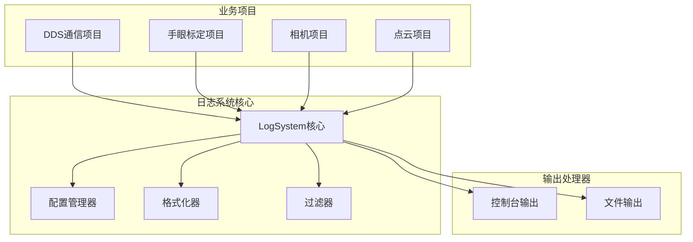
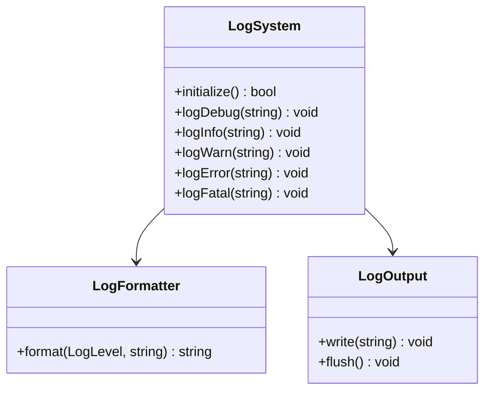
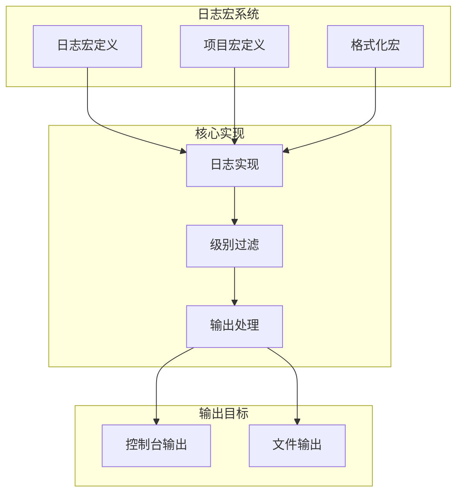

# 日志系统配置指南

## 📋 概述

log_system是一个高度独立、通用的ROS2日志管理系统，为DDS通信项目提供统一的日志记录功能。项目基于宏定义实现，无需复杂的初始化过程。

### 🎯 核心特性
- ✅ **零配置启动**: 使用默认配置即可开始记录日志
- ✅ **宏定义简化**: 通过预定义宏简化日志调用
- ✅ **项目隔离**: 每个项目有独立的日志标识
- ✅ **性能优化**: 轻量级实现，对系统性能影响小
- ✅ **多输出支持**: 控制台、文件输出等

## 🏗️ 系统架构

### 整体架构设计



### 核心类关系图


### 日志宏架构图



## ⚙️ 配置说明

### 当前实现状态

**log_system采用零配置启动模式**，无需手动配置文件即可使用。系统提供默认配置，支持基本的日志记录功能。

### 默认配置参数

**当前使用的默认配置**:
- **日志级别**: DEBUG (开发阶段)
- **输出目标**: 控制台输出
- **格式化**: 基础时间戳和消息格式
- **项目标识**: 自动识别项目类型

### 计划中的配置功能

**基础配置 (计划实现)**
```yaml
# log_system基础配置文件
log_system:
  # 全局日志级别: DEBUG, INFO, WARN, ERROR
  log_level: "INFO"
  
  # 输出目标配置
  outputs:
    console:
      enabled: true
      level: "INFO"
    
    file:
      enabled: false
      level: "DEBUG"
      path: "~/ros2_logs"
```

### 项目特定配置 (计划实现)

```yaml
# 项目级别日志配置
projects:
  dds_comm:
    level: "DEBUG"
    console_enabled: true
    
  hand_eye_calib:
    level: "INFO"
    console_enabled: true
```

## 🔧 代码集成

### 基本使用方式

log_system通过宏定义提供简洁的日志接口，无需手动初始化：

```cpp
#include "log_system/log_macros.hpp"

// 定义当前项目类型（在头文件中）
constexpr ProjectType CURRENT_PROJECT = ProjectType::DDS_COMMUNICATION;
const std::string CURRENT_PROJECT_NAME = getProjectLogName(CURRENT_PROJECT);

// 在代码中直接使用日志宏
void someFunction() {
    LOG_INFO("函数开始执行");
    
    // 带格式的日志
    int value = 42;
    LOG_INFO_FMT("当前值: %d", value);
    
    // 项目特定的日志
    LOG_PROJECT_INFO(CURRENT_PROJECT_NAME, "项目特定信息");
    LOG_PROJECT_DEBUG_FMT(CURRENT_PROJECT_NAME, "调试信息: %s", "详细信息");
}
```

### DDS项目中的实际使用示例

参考DDS通信项目的实际实现：

```cpp
// 在dds_service.cpp中的使用示例
DdsService::DdsService(bool is_server, const std::string& config_file)
    : is_server_(is_server), service_state_(ServiceState::INITIALIZING) {
    
    // 初始化日志系统 - 自动使用默认配置
    LOG_INIT();
    
    // 注册当前项目日志器
    LOG_PROJECT_INFO(CURRENT_PROJECT_NAME, "DDS通信服务日志器初始化完成");
    LOG_INFO("DDS通信服务使用log_system日志框架，默认启用调试日志");
    
    // 更多日志示例
    if (!config_file.empty()) {
        LOG_PROJECT_INFO_FMT(CURRENT_PROJECT_NAME, "配置文件路径: %s", config_file.c_str());
    }
}
```

### 支持的日志宏

| 宏名称 | 级别 | 说明 | 示例 |
|--------|------|------|------|
| LOG_DEBUG() | DEBUG | 调试信息 | `LOG_DEBUG("调试消息")` |
| LOG_INFO() | INFO | 一般信息 | `LOG_INFO("信息消息")` |
| LOG_WARN() | WARN | 警告信息 | `LOG_WARN("警告消息")` |
| LOG_ERROR() | ERROR | 错误信息 | `LOG_ERROR("错误消息")` |
| LOG_DEBUG_FMT() | DEBUG | 格式化调试 | `LOG_DEBUG_FMT("值: %d", value)` |
| LOG_INFO_FMT() | INFO | 格式化信息 | `LOG_INFO_FMT("结果: %s", result)` |
| LOG_PROJECT_DEBUG() | DEBUG | 项目调试 | `LOG_PROJECT_DEBUG(proj, "消息")` |
| LOG_PROJECT_INFO() | INFO | 项目信息 | `LOG_PROJECT_INFO(proj, "消息")` |

## 📊 日志级别说明

### 实际实现的日志级别

根据log_system的实际代码实现，支持的日志级别如下：

| 级别 | 说明 | 使用场景 | 实际代码示例 |
|------|------|----------|-------------|
| DEBUG | 调试信息 | 开发调试阶段 | `LOG_DEBUG("详细调试信息")` |
| INFO | 一般信息 | 正常运行状态 | `LOG_INFO("服务启动成功")` |
| WARN | 警告信息 | 潜在问题提醒 | `LOG_WARN("内存使用率偏高")` |
| ERROR | 错误信息 | 业务逻辑错误 | `LOG_ERROR("命令解析失败")` |

### 级别过滤机制

日志系统会自动根据配置的级别过滤日志，只有等于或高于配置级别的日志才会被输出。

## 🔄 配置加载机制

### 自动配置加载

log_system支持自动加载配置文件：

```cpp
// 自动从默认路径加载配置
LOG_INIT();

// 或指定配置文件路径
LOG_INIT_WITH_CONFIG("/path/to/log_config.yaml");
```

### 配置优先级

1. **代码中设置的级别** (最高优先级)
2. **项目特定配置**
3. **全局默认配置** (最低优先级)

## 🚀 部署指南

### 1. 环境要求
- Ubuntu 22.04 + ROS Humble
- C++17 编译器
- CMake 3.16+

### 2. 构建步骤
```bash
# 构建DDS通信项目（包含log_system）
cd ~/testCode/project
colcon build --packages-select dds_comm

# 加载环境
source install/setup.bash
```

### 3. 运行时配置

**当前实现状态**: 使用零配置启动模式，无需手动配置即可运行。

**验证日志系统工作**:
```bash
# 启动DDS服务查看日志输出
ros2 launch dds_comm dds_service.launch.py mode:=server

# 查看控制台日志输出
# 应该能看到格式化的日志信息
```

## 🔍 故障排除

### 常见问题及解决方案

1. **日志不输出**
   - 检查日志级别配置（当前默认DEBUG）
   - 确认宏定义正确引入
   - 验证项目名称定义

2. **性能问题**
   - 调整日志级别为WARN或ERROR（通过代码配置）
   - 减少不必要的DEBUG日志记录

3. **配置不生效**
   - 当前使用默认配置，无需手动配置
   - 检查代码中是否正确包含头文件

### 调试技巧

```cpp
// 启用详细调试日志（默认已启用）
LOG_DEBUG("详细调试信息");

// 项目特定调试
LOG_PROJECT_DEBUG(CURRENT_PROJECT_NAME, "详细调试信息");
```

## 📝 最佳实践

### 1. 合理的日志级别
- 生产环境使用INFO或WARN级别
- 开发环境使用DEBUG级别
- 错误处理使用ERROR级别

### 2. 有意义的日志消息
```cpp
// 好的示例
LOG_INFO("DDS服务初始化完成");
LOG_ERROR_FMT("命令处理失败: 错误码=%d, 消息=%s", error_code, error_msg);

// 避免的示例
LOG_INFO("这里");  // 无意义的消息
```

### 3. 项目标识使用
```cpp
// 在每个项目的头文件中定义
constexpr ProjectType CURRENT_PROJECT = ProjectType::YOUR_PROJECT;
const std::string CURRENT_PROJECT_NAME = getProjectLogName(CURRENT_PROJECT);

// 在代码中使用项目特定日志
LOG_PROJECT_INFO(CURRENT_PROJECT_NAME, "项目启动成功");
```

---

**文档版本**: v1.1  
**最后更新**: 2025年10月11日  
**相关文档**: [CONFIG_GUIDE.md](./CONFIG_GUIDE.md) | [TESTING_GUIDE.md](./TESTING_GUIDE.md)