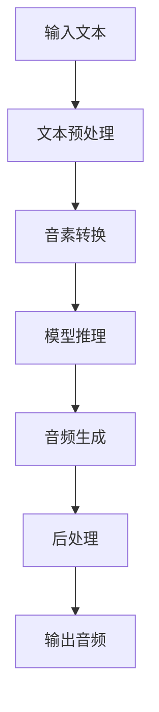

# Piper Speech Synthesis 语音合成系统

## 项目概述

基于 [Piper 项目](https://github.com/OHF-Voice/piper1-gpl) 实现的语音合成（TTS）系统，专门针对 Jetson Orin NX Super 开发板（Ubuntu 22.04 + ROS Humble 环境）优化。

### 主要特性

- ✅ **文本转语音合成** - 支持中文和英文等多种语言
- ✅ **WAV文件保存** - 生成的音频可保存为WAV格式
- ✅ **参数配置调整** - 灵活的配置系统支持多参数调整
- ✅ **多语音模型支持** - 支持切换不同语音模型
- ✅ **ARM64架构兼容** - 针对Jetson平台优化的CPU推理
- ✅ **ROS集成** - 支持与ROS Humble环境集成
- ✅ **批量处理模式** - 支持批量文本处理
- ✅ **实时预览功能** - 可实时监听合成效果

## 硬件和软件要求

### 硬件平台
- **开发板**: Jetson Orin NX Super 16GB
- **处理器**: NVIDIA Carmel ARM®v8.2 64位 CPU
- **GPU**: 1024核 NVIDIA Ampere 架构 GPU
- **内存**: 16GB 128位 LPDDR5

### 软件环境
- **操作系统**: Ubuntu 22.04
- **Python版本**: 3.10.12
- **JetPack版本**: 6.2及以上
- **L4T版本**: 36.4.7
- **CUDA版本**: 12.6
- **cuDNN版本**: 9.3
- **TensorRT版本**: 10.3
- **ROS版本**: ROS2 Humble

## 项目架构

```
piper_py/
├── piper_py/                 # 核心模块包
│   ├── __init__.py            # 包初始化文件
│   ├── tts_engine.py          # 语音合成引擎核心
│   ├── config_manager.py      # 配置管理系统
│   ├── audio_generator.py     # 音频生成和保存
│   ├── voice_model.py         # 语音模型管理
│   └── test_text_reader.py    # 测试文本读取模块
├── config/                    # 配置文件目录
│   ├── default.yaml           # 默认配置
│   └── jetson.yaml            # Jetson平台优化配置
├── cli/                       # 命令行工具
│   └── tts_cli.py             # 命令行界面
├── tests/                     # 测试模块
│   ├── quick_test.py          # 快速测试脚本
│   ├── test_interactive.py    # 交互式测试
│   ├── test_text_reader.py    # 测试文本读取模块
│   ├── test_tts.py            # TTS功能测试
│   └── test_basic.py          # 基础功能测试
├── scripts/                   # 部署脚本
│   ├── install_dependencies.py # 依赖安装脚本
│   └── jetson_setup.sh        # Jetson设置脚本
├── examples/                  # 使用示例
│   ├── basic_usage.py         # 基础使用示例
│   └── advanced_features.py   # 高级功能示例
├── docs/                      # 文档目录
│   └── DEPLOYMENT_GUIDE.md    # 详细部署指南
├── run_demo.py                # 演示脚本
├── test_text_reader.py        # 测试文本读取模块
├── setup.py                  # 项目安装配置
├── requirements.txt           # 依赖包列表
└── README.md                 # 项目说明文档

../resources/                  # 资源目录（与piper_py同级）
├── audio_data/                # 音频输出文件目录
├── models/                    # 语音模型目录
└── test_text/                 # 测试文本目录
```

## 核心模块详解

### 1. TTS Engine (tts_engine.py)

语音合成引擎核心模块，负责：

- **模型加载**: 加载ONNX格式的Piper语音模型
- **文本预处理**: 文本转音素序列转换
- **推理执行**: 使用ONNX Runtime进行推理
- **音频生成**: 生成PCM格式音频数据

```python
# 核心类：TTSEngine
class TTSEngine:
    def load_model(self, model_path: str, config_path: Optional[str] = None) -> bool
    def synthesize(self, text: str, speaker_id: Optional[int] = None) -> Optional[np.ndarray]
    def text_to_phonemes(self, text: str) -> List[str]
    def get_model_info(self) -> Dict[str, Any]
```

### 2. Config Manager (config_manager.py)

配置管理系统，支持：

- **多配置文件**: 支持YAML和JSON格式
- **平台特定配置**: Jetson平台优化配置
- **动态配置更新**: 运行时配置修改
- **配置验证**: 配置参数有效性检查

```python
# 核心类：ConfigManager
class ConfigManager:
    def load_config(self, config_file: str = "default.yaml") -> bool
    def load_platform_config(self, platform: str = "jetson") -> bool
    def get(self, key: str, default: Any = None) -> Any
    def set(self, key: str, value: Any) -> bool
    def validate_config(self) -> bool
```

### 3. Audio Generator (audio_generator.py)

音频生成和保存模块，提供：

- **WAV文件生成**: 标准WAV格式音频保存
- **音频处理**: 静音生成、音频连接、归一化等
- **批量处理**: 支持批量音频文件生成
- **格式转换**: PCM16位格式转换

```python
# 核心类：AudioGenerator
class AudioGenerator:
    def save_wav(self, audio_data: np.ndarray, file_path: str) -> bool
    def generate_silence(self, duration: float) -> np.ndarray
    def concatenate_audio(self, audio_segments: List[np.ndarray]) -> np.ndarray
    def normalize_audio(self, audio_data: np.ndarray) -> np.ndarray
```

### 4. Voice Model Manager (voice_model.py)

语音模型管理模块，实现：

- **模型发现**: 自动扫描模型目录
- **模型切换**: 运行时模型切换
- **模型信息**: 获取模型详细参数
- **多模型支持**: 支持多个语音模型并存

```python
# 核心类：VoiceModelManager
class VoiceModelManager:
    def scan_models(self) -> List[str]
    def set_current_model(self, model_name: str) -> bool
    def get_model_info(self, model_name: str) -> Optional[Dict]
    def add_model(self, model_path: str) -> bool
```

## 实现原理

### 1. 语音合成流程



### 2. 技术架构

- **前端处理**: 文本分词、音素转换
- **模型推理**: ONNX Runtime + CPU推理（ARM64兼容）
- **后端处理**: 音频生成、格式转换
- **配置管理**: 分层配置系统

### 3. Jetson平台优化

- **ARM64兼容**: 使用ONNX Runtime CPU版本，专为Jetson ARM64架构优化
- **内存优化**: 针对Jetson内存限制优化
- **性能调优**: 多线程和批处理优化
- **电源管理**: 低功耗模式支持

## 快速开始

### 1. 环境准备

确保Jetson Orin NX Super已安装：
- Ubuntu 22.04
- Python 3.10.12
- 必要的系统依赖

### 2. 智能安装（推荐）

使用智能安装脚本自动完成所有依赖安装：

```bash
# 进入项目目录
cd piper_py

# 运行智能安装脚本
python install_speech_env.py

# 激活虚拟环境
source ./activate_speech_env.sh  # Linux/macOS
# 或
activate_speech_env.bat          # Windows
```

**智能安装脚本特性**：
- ✅ 自动创建Python虚拟环境 `speech_env`
- ✅ 检查依赖包是否已安装，避免重复安装
- ✅ 版本兼容性检查和验证
- ✅ 安装完成后自动测试
- ✅ 创建激活脚本方便使用

### 3. 传统部署（备选）

```bash
# 克隆项目
git clone <repository-url>
cd piper_speech

# 手动创建虚拟环境
python -m venv speech_env

# 激活环境
source speech_env/bin/activate

# 安装依赖
pip install -r requirements.txt
```

### 3. 下载语音模型

从以下链接下载Piper语音模型：
- [官方模型仓库](https://github.com/rhasspy/piper/releases)
- [社区模型](https://huggingface.co/rhasspy/piper-voices)

将模型文件(.onnx和.json)放置到 `../resources/models/` 目录。

### 4. 运行演示

```bash
# 运行基础演示
python run_demo.py

# 使用命令行工具
python cli/tts_cli.py -t "你好，世界！" -o output/hello.wav

# 批量处理
python cli/tts_cli.py -f input.txt -o output/batch/
```

## 详细使用指南

### 1. 基础使用

```python
import sys
sys.path.append('.')
from piper_py import TTSEngine, ConfigManager, AudioGenerator

# 初始化配置
config_manager = ConfigManager("config")
config_manager.load_config("default.yaml")
config_manager.load_platform_config("jetson")

# 创建引擎
tts_engine = TTSEngine()
tts_engine.load_model("../resources/models/en_US-lessac-medium.onnx")

# 合成语音
audio_data = tts_engine.synthesize("Hello, this is a test.")

# 保存音频
audio_generator = AudioGenerator()
audio_generator.save_wav(audio_data, "../resources/audio_data/test.wav")

# 关闭引擎
tts_engine.close()
```

### 2. 高级功能

#### 批量处理
```python
# 批量文本处理
texts = ["Text 1", "Text 2", "Text 3"]
for text in texts:
    audio_data = tts_engine.synthesize(text)
    # 处理音频...
```

#### 音频处理
```python
# 音频归一化
normalized_audio = audio_generator.normalize_audio(audio_data)

# 去除静音
trimmed_audio = audio_generator.trim_silence(audio_data)

# 连接音频
combined_audio = audio_generator.concatenate_audio([audio1, audio2])
```

#### 配置管理
```python
# 动态配置修改
config_manager.set("audio.sample_rate", 16000)
config_manager.set("performance.threads", 8)

# 保存配置
config_manager.save_config("custom_config.yaml")
```

### 3. 命令行工具

```bash
# 基础使用
python cli/tts_cli.py -t "测试文本" -o ../resources/audio_data/test.wav

# 使用自定义配置
python cli/tts_cli.py -t "测试" -c config/jetson.yaml -o ../resources/audio_data/test.wav

# 批量处理
python cli/tts_cli.py -f input.txt -o ../resources/audio_data/ --batch-size 4

# 详细输出
python cli/tts_cli.py -t "测试" -o ../resources/audio_data/test.wav -v
```

## ROS Humble 集成

### 1. 创建ROS包

```bash
# 创建ROS工作空间
mkdir -p ~/ros2_ws/src
cd ~/ros2_ws/src

# 创建ROS包
ros2 pkg create piper_tts --build-type ament_python --dependencies rclpy std_msgs
```

### 2. 集成Piper TTS

创建ROS节点文件 `piper_tts/node.py`：

```python
import rclpy
from rclpy.node import Node
from std_msgs.msg import String

# 导入Piper TTS
import sys
sys.path.append('/home/nvidia/piper_speech')
from piper_py import TTSEngine, AudioGenerator

class PiperTTSNode(Node):
    def __init__(self):
        super().__init__('piper_tts_node')
        
        # 初始化TTS引擎
        self.tts_engine = TTSEngine()
        self.tts_engine.load_model('../resources/models/en_US-lessac-medium.onnx')
        
        # 创建订阅者和发布者
        self.subscription = self.create_subscription(
            String, 'tts_input', self.tts_callback, 10)
        self.audio_pub = self.create_publisher(String, 'audio_output', 10)
        
    def tts_callback(self, msg):
        text = msg.data
        audio_data = self.tts_engine.synthesize(text)
        
        if audio_data is not None:
            # 保存音频并发布路径
            output_path = f'/tmp/tts_{int(time.time())}.wav'
            AudioGenerator().save_wav(audio_data, output_path)
            
            audio_msg = String()
            audio_msg.data = output_path
            self.audio_pub.publish(audio_msg)
```

### 3. 编译和运行

```bash
# 编译ROS包
cd ~/ros2_ws
colcon build --packages-select piper_tts

# 运行节点
source install/setup.bash
ros2 run piper_tts piper_tts_node
```

## 性能优化

### 1. 性能配置

```yaml
# config/jetson.yaml
performance:
  use_cpu: true
  threads: 8
  optimization_level: 3
  cpu_mem_limit: 2147483648  # 2GB
  batch_size: 4
```

### 2. 内存优化

```python
# 启用内存优化
session_options = ort.SessionOptions()
session_options.enable_cpu_mem_arena = False
session_options.enable_mem_pattern = False
```

### 3. 批处理优化

```python
# 批量处理提高吞吐量
config_manager.set("synthesis.batch_size", 4)
```

## 故障排除

### 常见问题

1. **模型加载失败**
   - 检查模型文件路径和权限
   - 验证ONNX模型完整性
   - 确认依赖包版本兼容性

2. **ARM64架构兼容问题**
   - ONNX Runtime GPU版本不支持ARM64，请使用CPU版本
   - 确认使用`onnxruntime>=1.14.0`而不是`onnxruntime-gpu`
   - 检查Jetson平台特定依赖

3. **音频输出问题**
   - 验证音频设备权限
   - 检查采样率设置
   - 确认WAV文件格式

### 调试方法

```python
import logging
logging.basicConfig(level=logging.DEBUG)

# 启用详细日志输出
from piper_py import TTSEngine
tts_engine = TTSEngine()
# 进行调试...
```

## 扩展开发

### 添加新功能

1. **自定义音素转换器**
   ```python
   class CustomPhonemizer:
       def text_to_phonemes(self, text: str) -> List[str]:
           # 实现自定义音素转换逻辑
           pass
   ```

2. **音频效果处理器**
   ```python
   class AudioEffectProcessor:
       def apply_effects(self, audio_data: np.ndarray) -> np.ndarray:
           # 实现音频效果处理
           pass
   ```

3. **流式处理支持**
   ```python
   class StreamingTTS:
       def synthesize_stream(self, text: str) -> Generator:
           # 实现流式语音合成
           pass
   ```

## 许可证

本项目基于 [Piper 项目](https://github.com/OHF-Voice/piper1-gpl) 的GPL许可证。

## 贡献指南

欢迎提交Issue和Pull Request来改进项目。

## 联系方式

- 项目主页: [GitHub Repository]
- 问题反馈: [GitHub Issues]
- 文档更新: 查看 `docs/` 目录

## 版本历史

- **v1.0.0** (2025-11-07): 初始版本发布
  - 基础语音合成功能
  - Jetson平台优化
  - ROS Humble集成支持
  - 完整的文档和示例

- **v1.0.1** (2025-11-11): 路径优化版本
  - 更新音频输出文件路径到`../resources/audio_data`目录
  - 更新测试文本路径到`../resources/test_text`目录
  - 更新TTS模型文件路径到`../resources/models`目录
  - 更新项目架构和文档说明
  - 确保项目可通过ROS Humble的colcon build构建成功

---

**注意**: 本文档会根据项目发展持续更新，请定期查看最新版本。