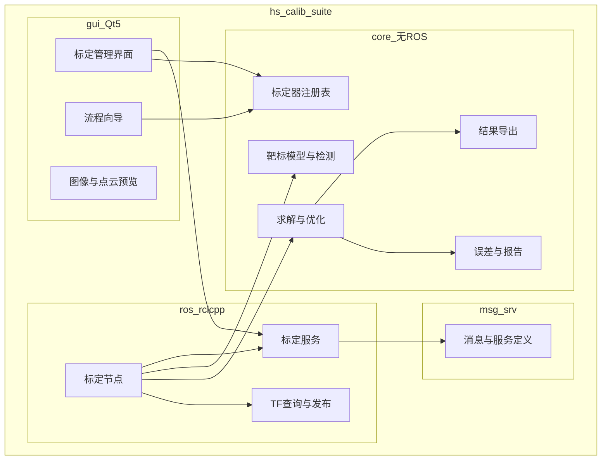
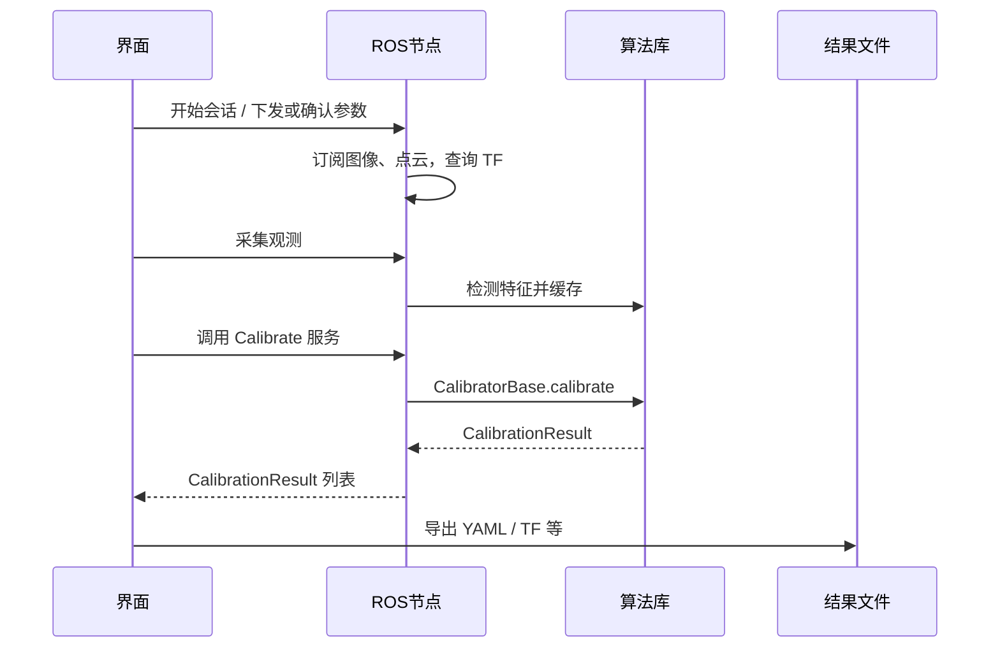

# 架构与接口说明

类图与分层类设计见 **[CLASS_DIAGRAMS.md](CLASS_DIAGRAMS.md)**。  
界面信息架构与线框见 **[UI_CONCEPT.md](UI_CONCEPT.md)**。

## 1. 分层结构



**允许的依赖方向：**

```text
gui  → core          （离线：界面直接调用算法库）
gui  → ros           （在线：经服务调用节点；P1 起完善）
ros  → core、消息类型
core → 第三方库（Eigen；P1 起 OpenCV）
消息 → geometry_msgs、std_msgs 等
```

**禁止：**

- `core` 依赖 ROS  
- 在 `gui` 中实现 BA、PnP、`calibrateCamera` 等求解  
- 使用 Python 编写业务或算法逻辑  

---

## 2. 在线标定数据流



离线路径：界面（或命令行工具）直接调用 `core`，不启动 ROS 节点。

---

## 3. 算法库接口（`core/`）

占位与基础头：`core/base/`（`*_base.hpp`、`interfaces.hpp`）、`core/types/`、`core/registry/`。  
实现按子目录拆分：`targets/`、`detectors/`、`calibrators/`、`io/`、`util/`（与 `src/core/` 镜像）。

GUI 同样按职责分子目录：`window/`、`panels/`、`session/`、`bridges/`、`widgets/`、`log/`、`data/`、`theme/`；主窗口实现拆为 `main_window*.cpp` 多编译单元，避免单文件过大。

界面日志走 `append_log(LogLevel, …)`：终端用 `rclcpp`（`hs_calib_gui`），UI 按等级着色（Error 红、Warn 橙），不按正文正则猜测等级。预览控件为本地 `ImageViewWidget`（缩放/平移/像素取值），不依赖 `image_widget` / `log_system`。

```text
hs_calib::core::CalibratorBase::calibrate(...)
hs_calib::core::CalibratorRegistry::register_calibrator / create / list_ids
```

`CalibrationResult`（算法层结构体，不含 ROS 消息类型）：

| 字段 | 含义 |
|------|------|
| `success` | 是否求解成功 |
| `score` | 主误差指标（例如重投影 RMSE） |
| `message` | 给人阅读的说明或错误信息 |
| `transforms` | 坐标系变换：`父坐标系 → 子坐标系 → 4×4 矩阵` |
| `intrinsics_meta` | 内参相关键值（P1 再改为结构化字段） |
| `metrics` | 其它数值指标 |

---

## 4. ROS 服务约定（本包 `msg/`、`srv/`）

### `Calibrate.srv`

- 请求：`session_id`、`calibrator_id`（观测数据主要来自节点内部缓存与参数）  
- 响应：`success`、`message`、`CalibrationResult[]`

`CalibrationResult.msg` 包含：`TransformStamped`、`success`、`score`、`message`、`CalibrationScore[]`。

设计意图与 TIER IV 类似：**标定节点不绑定某一车型的 TF 树**；需要的坐标系换算放在管理界面或 `ResultPostProcessor`（P2）中完成。

### `GetCalibratorInfo.srv`

供界面查询标定器能力：显示名称、类别、所需坐标系、支持的靶标类型等。

---

## 5. `ros/` 与 `core/` 的职责划分

| 放在 `ros/` | 放在 `core/` |
|-------------|--------------|
| 话题订阅与发布、TF 查询 | 角点 / Tag 等特征检测 |
| 参数声明与校验 | PnP、双目标定、手眼求解等 |
| 调用 `core` 并填充 ROS 消息 | 重投影误差计算与报告生成 |
| 从 `config/*.yaml` 加载参数 | 结果导出为 YAML / JSON（纯函数） |

P0：`placeholder_calibrator` 启动时自动加载 `config/placeholder_calibrator.yaml`，服务仅返回「尚未实现」。

---

## 6. 项目与标定器组织方式

参考 TIER IV 的「项目 + 标定器」组合，本工程计划（P1 起）：

```text
config/<项目名>/<标定器名>.yaml
include/hs_calib_suite/gui/projects/...    # 可选
src/core/calibrators/<标定器名>.cpp
```

典型流程：在管理界面选择项目与标定器 → `ros2 run` 并加载对应配置 → 调用服务求解 → 后处理 → 保存结果。  
仅在必须同时拉起多个进程时才考虑 launch；默认仍优先 `ros2 run` + `config`。

---

## 7. 导出文件约定（草案）

| 产物 | 用途 |
|------|------|
| `camera_info.yaml` 或 ROS `CameraInfo` | 相机内参 |
| `extrinsics.yaml` | 外参：父子坐标系、平移与姿态 |
| `tf_static.json` | 批量静态 TF |
| `report.md` / `metrics.json` | 标定质量报告 |

字段在 P1 首次实现内参导出时定稿，并补充 `docs/EXPORT_SCHEMA.md`。
