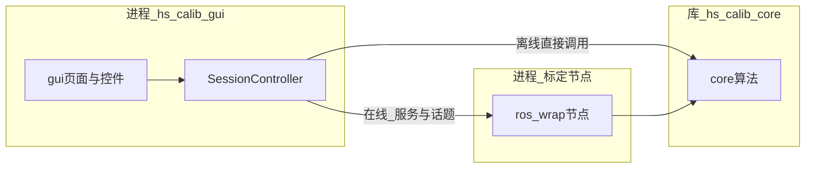
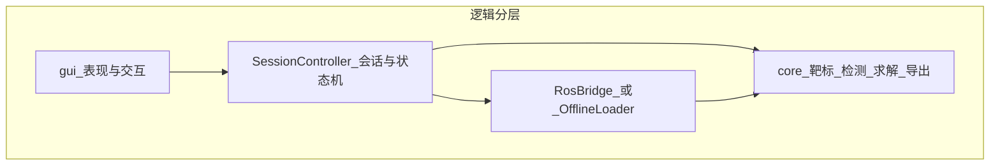
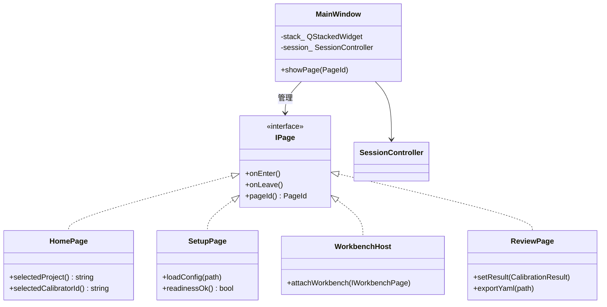
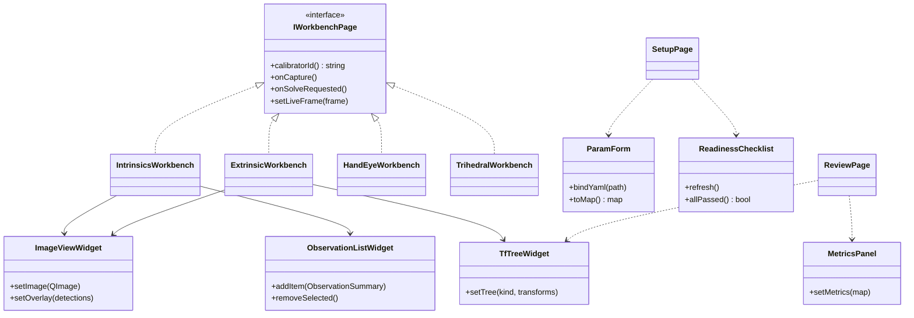
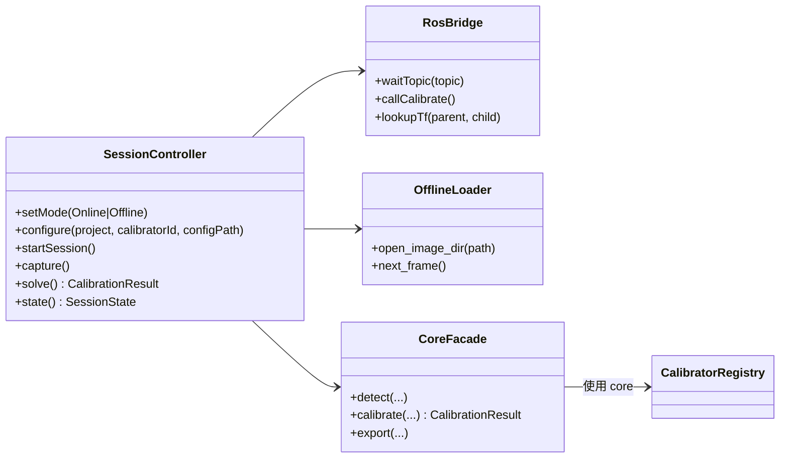
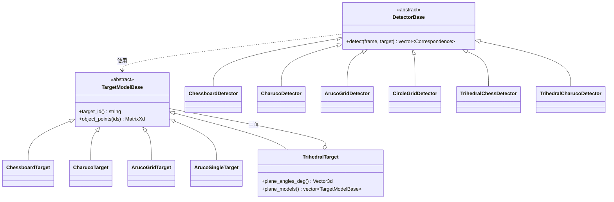
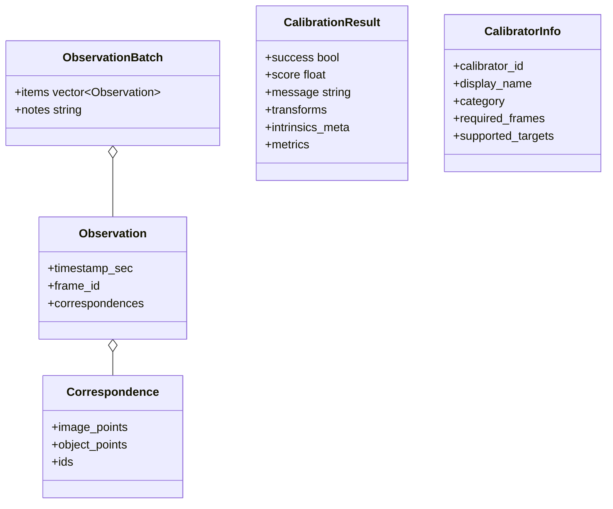
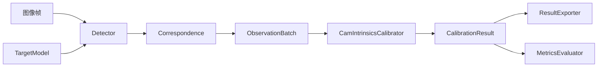
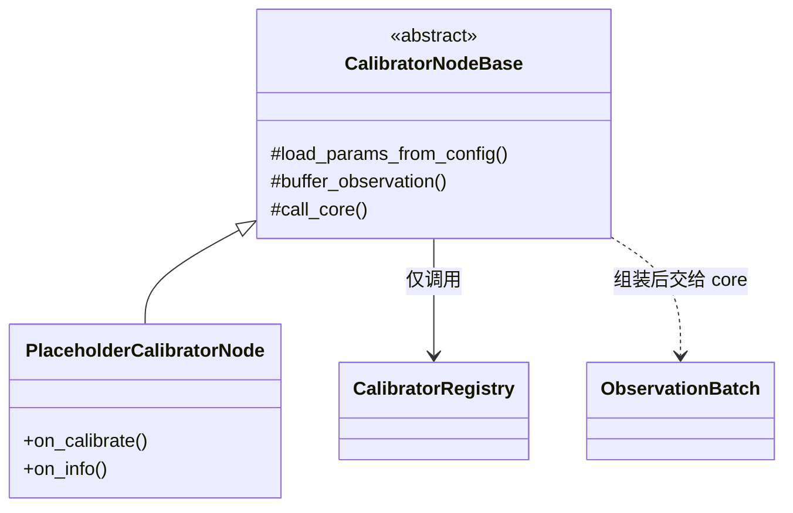

# 架构图与类图

本文给出 **UI 层**与 **标定算法层（core）** 的前期类设计，供 P1 实现对照。  
命名空间：`hs_calib::gui`、`hs_calib::core`、`hs_calib::ros_wrap`。  
实现语言：C++17；界面 Qt5；算法库不依赖 ROS。

相关文档：[ARCHITECTURE.md](ARCHITECTURE.md)、[UI_CONCEPT.md](UI_CONCEPT.md)、[TAXONOMY.md](TAXONOMY.md)。

---

## 1. 总架构图（进程与库）





---

## 2. UI 类图

### 2.1 页面与外壳



### 2.2 工作台插件与通用控件



### 2.3 会话控制（界面侧，不含求解）



**SessionState 建议枚举：** `Idle` → `Configuring` → `Ready` → `Collecting` → `Solving` → `Review` → `Exported`（失败回到 `Ready` 或 `Collecting`）。

---

## 3. 标定算法类图（`core/`）

### 3.1 靶标与检测



### 3.2 观测与结果



### 3.3 标定器与注册表

```mermaid
classDiagram
  direction TB

  class CalibratorBase {
    <<abstract>>
    +calibrator_info() CalibratorInfo
    +calibrate(batch, config) CalibrationResult
  }

  class CamIntrinsicsCalibrator
  class EyeInHandCalibrator
  class EyeToHandCalibrator
  class StereoExtrinsicsCalibrator
  class TrihedralOneshotCalibrator
  class CamLidarPnPCalibrator

  note for CamIntrinsicsCalibrator
    已实现：chessboard → calibrateCamera
    注册 ID: cam_intrinsics
  end note
  note for EyeInHandCalibrator
    已实现：PnP + calibrateHandEye
    注册 ID: eye_in_hand
  end note
  note for EyeToHandCalibrator
    已实现：PnP + calibrateHandEye(逆位姿)
    注册 ID: eye_to_hand
  end note

  CalibratorBase <|-- CamIntrinsicsCalibrator
  CalibratorBase <|-- EyeInHandCalibrator
  CalibratorBase <|-- EyeToHandCalibrator
  CalibratorBase <|-- StereoExtrinsicsCalibrator
  CalibratorBase <|-- TrihedralOneshotCalibrator
  CalibratorBase <|-- CamLidarPnPCalibrator

  class CalibratorRegistry {
    +register_calibrator(id, factory)
    +create(id) unique_ptr~CalibratorBase~
    +list_ids() vector
  }

  CalibratorRegistry ..> CalibratorBase : 创建

  class ResultExporter {
    +to_camera_info_yaml(result, path)
    +to_extrinsics_yaml(result, path)
    +to_report(result, path)
  }

  class MetricsEvaluator {
    +reprojection_rmse(...)
    +epipolar_error(...)
  }

  CalibratorBase ..> ObservationBatch : 输入
  CalibratorBase ..> CalibrationResult : 输出
  ResultExporter ..> CalibrationResult
  MetricsEvaluator ..> CalibrationResult
```

### 3.4 典型求解依赖（内参示例）



---

## 4. ROS 薄封装类图（`ros/`）



节点 **不继承** 算法类；只持有配置、缓存观测，并调用 `CalibratorRegistry::create(...)->calibrate(...)`。

---

## 5. 目录落地（与实现对齐）

```text
include/hs_calib_suite/
  core/
    types.hpp
    interfaces.hpp
    registry.hpp
    calibrator_base.hpp
    detector_base.hpp
    target_model_base.hpp
    targets/       # chessboard / charuco / aruco_grid / circle_grid / trihedral
    detectors/     # 对应检测器 + aruco_dict
    calibrators/   # cam_intrinsics / trihedral_oneshot / eye_*
    io/            # board_config_yaml / board_pose / export_camera_yaml
    util/          # cv_bridge_local
  gui/
    ...
  ros/
    ...
```

`src/core/` 镜像上述子目录；冒烟工具放在 `src/core/tools/`。
