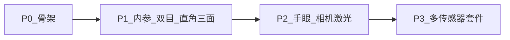

# 工程边界：独立自研，不使用仓库内旧标定代码

## 1. 强制约定

`hs_calib_suite` 从零编写。**禁止**：

- 复制、粘贴或移植 `calib_sim`、`project/src/calib/*` 等现有标定源码  
- 在 `CMakeLists.txt` / `package.xml` 中依赖上述功能包  
- 把旧包当作半成品，再「逐步搬进」本工程  

原因：旧实现可能存在分层不清、接口不稳或其它缺陷。本工程必须保持 `core/`（算法）、`ros/`（通信）、`gui/`（界面）边界清晰。

允许参考的外部对象仅限于**公开文档与标准**，例如 OpenCV 文档、ROS 2 惯例，以及 [TIER IV CalibrationTools](https://github.com/tier4/CalibrationTools) 的**架构思路**——不是本仓库里的旧实现。

---

## 2. 与旧目录的关系

| 路径 | 对本工程的含义 |
|------|----------------|
| `simulation/src/calib_sim` | 不使用：不阅读、不移植、不链接 |
| `project/src/calib/*` | 不使用：不阅读、不移植、不链接 |
| 其它现场标定脚本 | 不接入本工程 |

旧包是否保留、是否仍给现有产线使用，由原维护方决定，**不属于本工程职责**。

---

## 3. 本工程自行实现的范围

| 阶段 | 内容（全部新写） |
|------|------------------|
| P0 | 单包骨架、接口占位、Qt 线框、`config` + `ros2 run` |
| P1 | 棋盘 / ChArUco / ArUco 检测；内参；双目；直角三面 |
| P2 | 手眼（眼在手上 / 眼在手外）；相机–激光外参；TF 后处理 |
| P3 | 多传感器套件编排、时间偏移标定等 |

---

## 4. 一句话

> 仓库内旧标定工程对本 Suite 视为不存在；只以本包源码与 `docs/` 为准。
