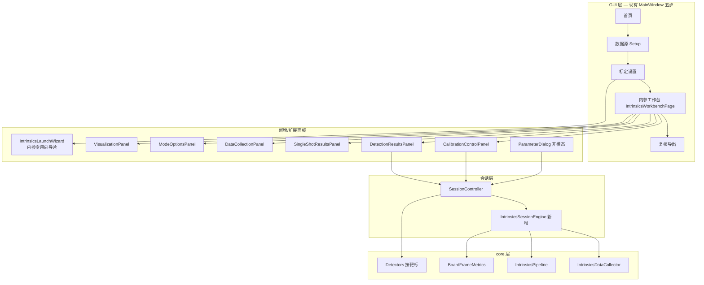

# Tier4 内参标定融合改进方案（v1.1 · 已确认）

> 目标：在 **保留 hs_calib_suite 更丰富靶标类型** 的前提下，将其余内参标定体验对齐 Tier4 `intrinsic_camera_calibrator`。  
> 参数语义以 [`TIER4_INTRINSICS_UI_SPEC.md`](TIER4_INTRINSICS_UI_SPEC.md) 为准。  
> **v1.1（2026-08-22）**：评审结论已纳入，可按 P0 起开发。

---

## 0. 设计原则

| 原则 | 说明 |
|------|------|
| **靶标更丰富** | 继续支持 chess / charuco / aruco / aruco_grid / aprilgrid / 圆点（对称+非对称）；Tier4 仅 chess / dot / apriltag |
| **流程不推翻** | 保留现有「首页 → 数据源 → 标定设置 → 工作台 → 复核」五步；Tier4 单窗多 GroupBox → **映射到 Setup + Workbench** |
| **算法在 core** | 新增 `IntrinsicsSessionEngine`（采集双库、partial calib、指标计算）；GUI 只绑定参数与显示 |
| **参数可复刻** | 全部 Tier4 参数进 YAML + `ParameterView` 弹窗；Profile 一键加载默认值 |
| **渐进交付** | 按 P0→P4 分阶段，每阶段可独立验收 |

---

## 1. Solver selection 现状确认与融合决策

### 1.1 当前实现（已实现）

标定设置页 `LauncherConfigPanel` 有 **「求解预设」** 下拉：

| 选项 | 对应 Tier4 | 求解器 | 说明 |
|------|------------|--------|------|
| General | `general_intrinsics_calibrator.yaml` | OpenCV | k1–k2，采集阈值宽松 |
| C1 | `c1_intrinsics_calibrator.yaml` | OpenCV | k1–k3，采集更严 |
| Ceres | `ceres_intrinsics_calibrator.yaml` | Ceres | 有理畸变 + 系数正则 |
| C2 | `c2_intrinsics_calibrator.yaml` | Ceres | + FOV 正则 |

写入 `solve_options_["intrinsics_profile"]`，`cam_intrinsics_calibrator` 走 `IntrinsicsProfile` 流水线。

### 1.2 Tier4 原版

工作台仅有 **Solver selection**：`OpenCV` | `Ceres`（与 YAML profile 独立；启动时选 profile，运行时可切换求解器）。

### 1.3 融合决策（✅ 已确认）

```
┌─────────────────────────────────────────────────────────┐
│  标定设置（Setup）                                       │
│  ┌─────────────────────┐  ┌──────────────────────────┐  │
│  │ Profile 预设 ▼      │  │ General / C1 / Ceres / C2 │  │
│  │ （加载整套默认参数）   │  │ → 联动下方所有 Tier4 参数  │  │
│  └─────────────────────┘  └──────────────────────────┘  │
└─────────────────────────────────────────────────────────┘
┌─────────────────────────────────────────────────────────┐
│  工作台（Workbench）                                     │
│  ┌─────────────────────┐                                │
│  │ 求解器 ▼ OpenCV/Ceres│  ← 与 Tier4 一致的可视控件      │
│  │ Profile=C1 时默认 OpenCV；Ceres/C2 默认 Ceres         │
│  │ 用户可手动覆盖（高级）                                 │
│  └─────────────────────┘                                │
└─────────────────────────────────────────────────────────┘
```

- **保留** Profile 四档（比 Tier4 更好用，且已接好流水线）。
- **新增** 工作台 `求解器` 下拉（OpenCV / Ceres），与 Tier4 截图一致；切换 Profile 时自动联动，允许高级用户覆盖。
- **相机模型**（Brown / fisheye / CMei）仍在 Setup；仅 **Brown** 走 Tier4 全流水线，fisheye/CMei 保持现有 OpenCV 路径（不强行 Tier4 化）。

---

## 2. 总体架构



### 2.1 新增核心模块 `IntrinsicsSessionEngine`

| 职责 | Tier4 对应 | 说明 |
|------|------------|------|
| 训练/评估双库 | `DataCollector.training_data / evaluation_data` | 分流、occupancy、冗余判定 |
| Partial calib | `_calibrate_fast` | 采集中滚动更新临时 K/D |
| 帧指标 | `BoardDetection.*` | tilt/skew/RMS/linear error |
| 标定状态机 | `OperationMode` | idle / calibrating / evaluating |
| 参数包 | `ParameterizedClass` | calibration / collector / detector 三套 |

`SessionController` 在内参任务下 **委托** 给 `IntrinsicsSessionEngine`，其它标定器不变。

---

## 3. 页面映射：Tier4 模块 → 本工程位置

| # | Tier4 模块 | 融合位置 | 形态 |
|---|------------|----------|------|
| 0 | InitializationView（启动向导） | **数据源页 + 内参首进向导条** | 见 §4 |
| 2 | Solver selection | **工作台右栏顶部** | `QComboBox` OpenCV/Ceres |
| 3 | Calibration control | **工作台右栏** | 按钮 + 状态标签组 |
| 4 | Detection options | **工作台右栏** | 「检测器参数」按钮 |
| 5 | Detection results | **预览区下方 + 可弹出** | 折叠面板 / `QDockWidget` |
| 6 | Single-shot results | **紧贴 Detection results 下方** | 同上 |
| 7 | Calibration parameters | **非模态 ParameterDialog** | 从 Calibrate 区按钮打开 |
| 8 | Detector parameters | **非模态 ParameterDialog** | 按靶标动态表单 |
| 10 | Data collection parameters | **非模态 ParameterDialog** | 从采集区按钮打开 |
| 11 | Mode options | **预览区标题栏扩展** | 暂停 / 视图类型 / 滑块 |
| 12 | Data collection | **工作台右栏 + 观测列表 Tab** | Train/Eval 计数与 occupancy |
| 13 | Visualization options | **预览区 viz_strip 扩展** | 热力图/线性度/alpha |

---

## 4. 启动向导（需求 1）

### 4.1 现状与开发优先级（✅ 已确认）

**数据源三种形态**（统一抽象为「逐帧图像流」，仅入口不同）：

| 形态 | 说明 | 开发顺序 |
|------|------|----------|
| **ROS 话题（在线）** | 订阅实时 `sensor_msgs/Image` | **P0 主路径**，先打通全流水线 |
| 离线目录 | 扫描图片目录逐帧加载 | P1，复用同一采集/检测/标定逻辑 |
| **Rosbag** | **加载 bag 包逐帧解码标定**（非边播边采、非先导出 PNG） | P1，与话题共用帧回调，仅 `FrameSource` 实现不同 |

- `LauncherConfigPanel` 已有离线 / 话题 / Bag 入口；Bag 当前为「导出 PNG 再走离线」，**将改为直接读 bag 解码**（对齐 Tier4 `RosBagView` 语义）。
- 缺 Tier4 式「一步确认板型 + profile + 开始标定」的 **内参专用向导感**（P3 内参向导条）。

### 4.2 融合方案

**不新增独立弹窗**（避免与五步导航冲突），在 **数据源页顶部** 增加 **内参向导条**（仅 `cam_intrinsics` / `stereo_intrinsics` 显示）：

```text
┌─ 内参标定向导 ─────────────────────────────────────────────────────────┐
│ ① 数据源  [离线目录 ▼] [路径…]  |  [ROS话题 ▼]  |  [Rosbag ▼] [目录…] │
│ ② 靶标    [charuco ▼]  [板参数…]   ← 比 Tier4 多 charuco/aruco/aprilgrid │
│ ③ 预设    [General ▼]  [从 YAML 加载]                                  │
│                                              [检查就绪] [进入工作台 →]   │
└────────────────────────────────────────────────────────────────────────┘
```

**Rosbag 行为**（✅ 已确认）：

| 项 | 目标 |
|----|------|
| 选 bag 目录 | rosbag2 存储目录 |
| 列话题 | 选择 `sensor_msgs/Image` 话题 |
| 标定方式 | **加载包 → 按序解码帧 → 走与在线话题相同的检测/采集/标定** |
| 不做 | ~~边播边采~~、~~必须先导出 PNG 目录~~ |
| Pause | Mode options 的 Pause 在 bag 顺序回放时暂停取帧（P2，与话题 Pause 共用） |

```text
  RosTopic ──┐
  RosBag   ──┼──► FrameSource::next_frame() ──► SessionController（同一套内参引擎）
  Offline  ──┘
```

---

## 5. 工作台 UI 简图（核心）

### 5.1 整体布局（内参任务专用 `IntrinsicsWorkbenchPage`）

在现有 `build_workbench_page()` 基础上 **条件展开**（仅内参/双目标定器替换布局）：

```text
┌──────────────────────────────────────────────────────────────────────────────┐
│ 工作台 · 采集与求解          [上一张][下一张][检测][采集][求解][评估][保存][复核] │
├───────────────────────────────┬──────────────────┬───────────────────────────┤
│ 实时预览 (ImageViewWidget)     │ 观测列表          │ ▼ Solver [Ceres ▼]       │
│ ┌───────────────────────────┐ │ ┌──────────────┐ │ ▼ Calibration control   │
│ │                           │ │ │[训练][评估]Tab│ │   [标定参数][标定][评估] │
│ │   检测叠加 / 热力图         │ │ │ #01 train   │ │   status: idle          │
│ │                           │ │ │ #02 train   │ │   Training: 24 / …      │
│ └───────────────────────────┘ │ │ #03 eval    │ │   Evaluation: 8 / …     │
│ [实时][冻结] [视图类型 ▼]      │ └──────────────┘ │ ▼ Detection options     │
│ [Rectify: OpenCV ▼]           │ [删][清空]       │   [检测器参数…]          │
├───────────────────────────────┤                  │ ▼ Detection results      │
│ Detection results (折叠)       │                  │   Detected: True        │
│  Rough tilt / angles / pos …  │                  │   Skew / area / linear… │
├───────────────────────────────┤                  │ ▼ Single-shot results    │
│ Single-shot (折叠)             │                  │   Reproj max/avg/rms    │
│  Reproj max / avg / rms       │                  │ ▼ Data collection      │
├───────────────────────────────┤                  │   Train 24  Occ 43%     │
│ Viz: ☑检测 ☑训练点 ☑占用热力图  │                  │   Eval 8   Occ 32%    │
│     ☑线性度  alpha… [清线性度]  │                  │   [采集统计][采集参数]  │
└───────────────────────────────┴──────────────────┴───────────────────────────┘
```

**宽度策略**：

- 预览列：min 400，可拖到 55% 宽（比现 640px 上限更宽）。
- 观测列：180–280px；训练/评估 **Tab 分列表**。
- 右栏 Tier4 控制区：min 280，max 360，可滚动。

**空间不足时**：

- Detection results + Single-shot → 默认折叠各 2 行摘要；点击 **「展开检测详情」** 打开 **非模态** `IntrinsicsMetricsDock`（停靠右侧或底部）。
- Calibration / Data collection **参数弹窗** 一律 **非模态** `QDialog` + `Qt::Window`，可同时对照预览调参。

### 5.2 与现有 UI 关系

```text
现有（非内参任务）          内参/双目内参任务
─────────────────          ─────────────────
预览 | 观测列表 | 4 指标卡   →  预览+结果区 | 观测Tab | Tier4 右栏
viz_strip 4 项              →  扩展为 Visualization options 全套
求解按钮                    →  拆为 标定 + 评估 + 保存
复核页图表                  →  保留；Calibrate 后 matplotlib 统计可选入复核
```

---

## 6. 分项复刻清单（对应你的 1–13）

### 6.1 Calibration control（3）— 全部复刻

| UI | 行为 |
|----|------|
| Calibration parameters | 打开 §7 全部参数 |
| Calibrate | 训练集完整流水线；更新 status + RMS 行 |
| Evaluate | 不重新优化；post rejection + train/eval RMS |
| Save | 导出 camera YAML（复核页亦可导出） |
| Calibration status | idle / calibrating / evaluating |
| Calibration time | 上次耗时 |
| Training samples 块 | 总数、pre/post inliers、rms all/inlier |
| Evaluation samples 块 | 同上 |

### 6.2 Detection options（4）

- 按钮 **Detector parameters** → 按当前 `target_type` 切换表单（§8）。
- 靶标多于 Tier4 时：**同一按钮，不同参数 schema**（charuco 等在 Tier4 无的项走扩展段）。

### 6.3 Detection results（5）— 全部字段

实时刷新（每帧检测完成）：

`Detected`, `Rough tilt`, `Rough angles (x,y)`, `Rough position (x,y,z)`, `Skew`, `Relative area`, `Linear error rows/cols rms`, `Aspect ratio`

实现：`core::BoardFrameMetrics` + `SessionController::detection_metrics_signal`

### 6.4 Single-shot detection results（6）

`Reprojection error (max/avg/rms)` + **相对格距 %**（与 Tier4 一致）

依赖 partial / calibrated model。

### 6.5 Calibration parameters（7）— 全部参数

[`TIER4_INTRINSICS_UI_SPEC.md` §8](TIER4_INTRINSICS_UI_SPEC.md) 全部进 `IntrinsicsCalibrationParams` + 弹窗。

OpenCV 专有 5 项仅 `solver=OpenCV` 时显示；Ceres 专有 3 项仅 `solver=Ceres` 时显示。

### 6.6 Detector parameters（8）— 全部参数

| 靶标 | 参数集 |
|------|--------|
| chessboard | §9.2 八项 + ROI |
| circles_* | §9.1 八项 |
| aprilgrid | §9.3 AprilTag 九项 + 板几何（映射现有 aprilgrid 检测器） |
| charuco / aruco / aruco_grid | **扩展段**（Tier4 无；保留优势，默认值合理即可） |

### 6.7 Data collection parameters（10）— 全部参数

§10 全部 → `IntrinsicsDataCollectorParams` + 弹窗。

### 6.8 Mode options（11）

| 控件 | 实现 |
|------|------|
| Pause/Resume | 暂停检测与自动采集 |
| Image view type | Source unrectified / rectified / Training DB / Evaluation DB |
| Training/Evaluation sample 滑块 | 浏览已采帧 |
| Rectify option | OpenCV / Fixed aspect ratio |

### 6.9 Data collection（12）

- 训练/评估 **样本数**、**occupancy %**
- 按钮：View data collection statistics（**可配置** Qt 轻量图 / matplotlib 非模态窗，见 §7.1）
- 按钮：Data collection parameters

观测列表 **Tab：[训练] [评估]**，与 Tier4 双库一致。

### 6.10 Visualization options（13）

| 选项 | 预览叠加 |
|------|----------|
| Draw detection | 当前帧格点 |
| Draw training/evaluation points | 历史像点云 |
| Draw training/evaluation occupancy | 16×16 热力图 |
| Draw linearity error | 线性度热力图 |
| Draw indicators | 速度/skew/尺寸进度条 |
| Drawings / Undistortion / Indicators alpha | 滑块 |
| Clear heatmap linearity | 重置 |

与现有 `viz_strip` 合并，内参任务显示全套，其它任务保持精简。

---

## 7. 分阶段实施计划（融合 P0–P4）

### 7.1 统计图后端（✅ 已确认：可配置）

配置键建议：`gui.stats_backend` = `qt` | `matplotlib`（默认 `qt`，无 matplotlib 依赖时自动回退）。

| 场景 | Qt 轻量图 | matplotlib |
|------|-----------|------------|
| View data collection statistics | `QChart` 旋转热力图 + 直方图 | 非模态窗，Tier4 同款多子图 |
| Calibrate 后残差/分布 | 复核页 `ResidualBarWidget` 等 | 可选详细分布图 |
| 环境 | 无额外依赖，Jetson 友好 | 需 `python3-matplotlib` 或嵌入 |

Setup 或设置页提供下拉；写入 project yaml，复核页与统计按钮共用同一后端。

### P0 — 行为对齐 + **在线话题主路径**（2–3 周当量）

**目标**：**ROS 话题**下采集/标定行为与 Tier4 一致；UI 暂用现有布局，core 先就绪。

| 任务 | 交付 |
|------|------|
| `FrameSource` 抽象 | 话题 / 离线 / Bag 统一接口（P0 仅实现 **RosTopic**） |
| `IntrinsicsDataCollector` | 训练/评估双库、分流、occupancy |
| Partial calib | `max_fast_calibration_samples=20` |
| 采集过滤全套 | 速度/重投影/2D冗余/倾角 |
| `BoardFrameMetrics` | 供 results / single-shot 计算 |
| Session 接入 | 自动采集走新引擎（**在线话题**） |
| Solver | 工作台增加 OpenCV/Ceres 下拉（联动 Profile） |

**验收**：**在线话题** + C1 profile 下采集 RMS>0.3 被拒；训练/评估计数分离；partial 模型驱动过滤。

### P1 — 工作台 Tier4 右栏（2 周）

| 任务 | 交付 |
|------|------|
| `CalibrationControlPanel` | §6.1 全部按钮与状态行 |
| `DetectionResultsPanel` + `SingleShotPanel` | 预览下折叠 + 摘要 |
| Evaluate / Save 按钮 | 从单一「求解」拆开 |
| 观测列表 Train/Eval Tab | |
| ParameterDialog 框架 | 非模态，三套参数壳 |

**验收**：对照 Tier4 截图，右栏信息与操作一一对应（数值一致）。

### P1b — 数据源扩展（约 3–5 天，与 P1 可并行）

| 任务 | 交付 |
|------|------|
| `OfflineFrameSource` | 目录扫图，复用 P0 引擎 |
| `RosBagFrameSource` | **直接读 bag 解码**，不复用 PNG 导出 |
| 向导条数据源区 | 三种源切换 UI 与就绪检查 |

**验收**：离线与 Bag 进入工作台后，检测/采集/标定与在线话题行为一致。

### P2 — 参数弹窗全量 + 模式/可视化（2 周）

| 任务 | 交付 |
|------|------|
| Calibration parameters 弹窗 | §8 全部字段 |
| Data collection parameters 弹窗 | §10 全部字段 |
| Detector parameters 弹窗 | 棋盘/圆点/aprilgrid 全量；charuco 扩展 |
| Mode options | 视图类型、滑块、rectify；**Pause**（话题 + bag 顺序回放） |
| Visualization 扩展 | 热力图、线性度、indicators |

**验收**：每项参数可改、可持久化到 project yaml；热力图可见。

### P3 — 统计与复核增强（1–2 周）

| 任务 | 交付 |
|------|------|
| View data collection statistics | 旋转热力图 + 2D/3D 直方图（**`gui.stats_backend` 可配置**） |
| Calibrate 后统计图 | 同上后端切换 |
| 复核页联动 | pre/post inliers、per-view RMS |
| 内参向导条 | §4.2 数据源+靶标+预设一行 |

**验收**：与 Tier4 「View statistics」信息等价；`qt` / `matplotlib` 可切换。

### P4 — 打磨与双目标定（1 周）

| 任务 | 交付 |
|------|------|
| `stereo_intrinsics` 复用同一 `IntrinsicsWorkbenchPage` | 左右侧标记 |
| 参数 schema 代码生成 / 校验 | 防止非法组合 |
| 性能 | 检测线程、ROI 棋盘跟踪 |

---

## 8. 配置与代码落点（预览）

```text
include/hs_calib_suite/
  core/calibrators/intrinsics/
    intrinsics_data_collector.hpp      # P0 双库
    intrinsics_session_engine.hpp      # P0 编排
    board_frame_metrics.hpp            # P0 指标
    intrinsics_params.hpp              # P1 三套参数 struct
  gui/intrinsics/
    calibration_control_panel.hpp
    detection_results_panel.hpp
    data_collection_panel.hpp
    mode_options_panel.hpp
    visualization_panel.hpp
    parameter_dialog.hpp
    intrinsics_workbench_layout.hpp    # P1 布局装配

config/intrinsics/
  general.yaml / c1.yaml / ceres.yaml / c2.yaml   # Tier4 profile 对齐
  detectors/
    chess_board.yaml
    dot_board.yaml
    apriltag_grid.yaml
```

**Profile 与 UI 关系**：

```yaml
# config/intrinsics/c1.yaml
intrinsics_profile: c1
calibrator_type: opencv          # 工作台 Solver 默认
calibration_parameters: { ... }  # §8
data_collector: { ... }          # §10
chess_board_detector: { ... }    # §9.2
```

切换 Profile → 刷新三套参数默认值（可再被用户改掉）。

---

## 9. 靶标「更丰富」的处理策略

```text
Tier4 原生靶标          hs_calib 扩展靶标
──────────────          ─────────────────
chessboard       →      chessboard（完全 Tier4 参数）
dot board        →      circles_symmetric / asymmetric（映射 dot 参数）
apriltag grid    →      aprilgrid（映射 apriltag 参数；码族 36h11 保留）

charuco          →      扩展 detector 参数页（字典、marker 等已有）
aruco / grid     →      同上
```

**原则**：Tier4 有的参数 **逐项对齐**；扩展靶标在弹窗底部增加 **「扩展」** 分组，不污染 Tier4 字段。

---

## 10. 效果预期

内参工作台大致效果：

1. **进入**：数据源选 话题（P0）/ 离线 / **Bag（加载包标定）** → 选靶标 → 选 Profile → 进工作台。  
2. **采集**：右侧见 Tier4 式训练/评估计数与 occupancy；自动采集受 C1 严格阈值约束；列表分 Tab。  
3. **预览**：除角点外，可叠加热力图、历史点、去畸变；**预览下折叠 Detection / Single-shot**，可弹出 Dock。  
4. **标定**：Calibrate 后右侧显示 pre/post inliers 与 RMS；Evaluate 单独验证；Save 出 YAML。  
5. **调参**：三个「…参数」非模态窗，边调边看预览与 single-shot RMS。  
6. **统计**：采集统计与标定后图表通过 **`gui.stats_backend`** 在 Qt / matplotlib 间切换。

与 Tier4 差异 **仅两处**（按你要求保留）：

- 靶标类型更多；  
- 五步导航 + 复核页（Tier4 单窗无复核页，我们保留作为增强）。

---

## 11. 已确认决策（评审记录）

| # | 决策 |
|---|------|
| A | **保留 Profile 四档 + 工作台补 OpenCV/Ceres 下拉** |
| B | **Detection results：预览下折叠 + 可弹出 Dock** |
| C | **Rosbag = 加载包逐帧标定**；不做边播边采、不依赖先导出 PNG |
| C′ | **P0 主路径：在线 ROS 话题**；离线/Bag 为 `FrameSource` 适配（P1b，改动面小） |
| D | **统计图：Qt 轻量图与 matplotlib 可配置**（`gui.stats_backend`） |
| E | **仅内参/双目内参任务**替换 Tier4 右栏；其它标定任务保持现有 4 指标卡布局 |

---

*文档版本：2026-08-23 v1.2 · P0–P4 首版已落地；统计图见 [`TIER4_INTRINSICS_STATS.md`](TIER4_INTRINSICS_STATS.md)*

---

## 12. 实现状态（2026-08-23）

| 阶段 | 状态 | 主要交付 |
|------|------|----------|
| P0 | ✅ | `IntrinsicsDataCollector`、`IntrinsicsSessionState`、`BoardFrameMetrics`、Session 双库采集、partial calib |
| P1 | ✅ | `IntrinsicsControlRail`、`IntrinsicsMetricsStrip`、训练/评估 Tab、标定/评估/保存拆分 |
| P1b | ✅ | `RosBagFrameReader` 直接解码、`SessionController::load_rosbag` |
| P2 | ✅ | 非模态 `IntrinsicsParameterDialog`（标定/采集/检测） |
| P3 | ✅ | 三张 Tier4 统计弹窗 + `IntrinsicsAsyncPlotController`；`gui.stats_backend`；复核页「标定统计…」 |
| P4 | ✅ | 导出 `calibration_*_statistics.png`；柱状图橙柱 = 逐帧 `calibrateCamera` 下界 RMS |
| P4b | ✅ | `stereo_intrinsics` 复用 Tier4 右栏布局 |

**代码落点**：

```text
core/calibrators/intrinsics/
  intrinsics_collector_params.*
  board_frame_metrics.*
  intrinsics_data_collector.*
  intrinsics_session_state.*
  intrinsics_pipeline.*              # 含 compute_single_shot_view_rms
  intrinsics_plot_statistics.*       # 统计 JSON 导出
gui/intrinsics/
  intrinsics_workbench_panels.*
  intrinsics_parameter_dialog.*
gui/plotting/
  intrinsics_plot_session.*            # 会话 → IntrinsicsPlotInput
  intrinsics_plot_renderer.*
  intrinsics_async_plot_controller.*
  intrinsics_plot_export.*
  intrinsics_*_dialog.*                # 三统计弹窗
scripts/
  plot_common.py
  intrinsics_collection_stats_plot.py
  intrinsics_calibration_bars_plot.py
  intrinsics_calibration_rms_plot.py
gui/bridges/ros_bag_frame_reader.*
```

详细统计图说明：**[`docs/TIER4_INTRINSICS_STATS.md`](TIER4_INTRINSICS_STATS.md)**。
