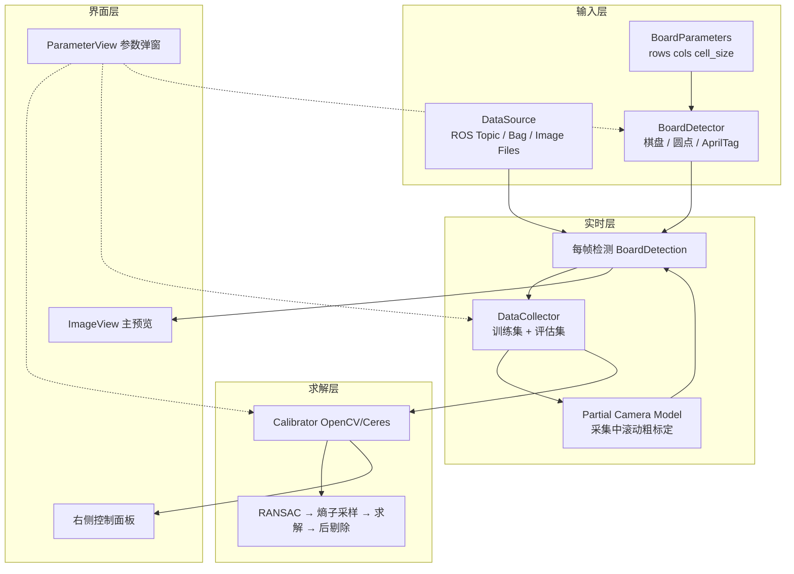

# Tier IV Intrinsic Camera Calibrator — 功能与参数规格书

> 基于你提供的界面截图 + 官方源码  
> [`tier4/CalibrationTools`](https://github.com/tier4/CalibrationTools)（分支 `tier4/universe`）  
> 主界面实现：`intrinsic_camera_calibrator/camera_calibrator.py`  
> 本文档用于 **hs_calib_suite 完整复刻** 的需求拆解与参数对齐。

---

## 1. 总体架构

Tier4 内参标定器是 **单窗口实时工具**（PySide2 + ROS2），不是「离线采图再求解」的两段式流程。核心由 5 层组成：



### 1.1 与 hs_calib_suite 当前差异（摘要）

| 能力 | Tier4 | hs_calib_suite 现状 |
|------|-------|-------------------|
| 训练集 / 评估集双库 | ✅ 自动分流 | ❌ 单一观测列表 |
| 采集中滚动粗标定（partial calib） | ✅ 驱动重投影过滤 | ⚠️ ≥6 帧后临时模型 |
| 实时检测质量面板 | ✅ 完整 | ⚠️ 仅置信度/多样性 |
| 占用率热力图 / 线性度热力图 | ✅ | ❌ |
| Source rectified 预览 | ✅ | ❌ |
| Evaluate 独立按钮 | ✅ | ❌ |
| 四种 YAML profile 一键切换 | ✅ 启动时选 profile | ⚠️ GUI 下拉 General/C1/Ceres/C2 |
| 圆点板专用检测参数 | ✅ DotBoardDetector | ⚠️ 通用圆网格，参数不全 |
| 棋盘 ROI 跟踪检测 | ✅ ChessBoardDetector | ⚠️ 无 ROI / padding / lost_frames |
| AprilTag 阵列检测参数 | ✅ ApriltagGridDetector (tag16h5) | ⚠️ AprilGrid 用 36h11，参数集不同 |
| matplotlib 标定统计图 | ✅ | ✅（`gui.stats_backend=matplotlib`，见 [`TIER4_INTRINSICS_STATS.md`](TIER4_INTRINSICS_STATS.md)） |

---

## 2. 界面模块拆解（对应你的截图）

整体布局：**左侧大预览** + **右侧多 GroupBox 控制面板**（可滚动）。

```
┌─────────────────────┬──────────────────────────────────┐
│                     │ Solver selection                 │
│                     │ Calibration control              │
│   ImageView         │ Detection options                │
│   (检测叠加/热力图)    │ Detection results                │
│                     │ Single-shot detection results    │
│                     ├──────────────────────────────────┤
│                     │ Mode options                     │
│                     │ Data collection                  │
│                     │ Visualization options            │
└─────────────────────┴──────────────────────────────────┘
```

另有 **启动向导** `InitializationView`（首次弹窗，不在主界面截图内）：
- 数据源：ROS Topic / ROS Bag / Image Files
- 板类型：Chess board / Dot board / Apriltag grid
- Board parameters（rows, cols, cell_size）
- Parameter profile YAML（general / c1 / ceres / c2）
- Operation mode：Calibration / Evaluation

---

## 3. 模块 A — Solver selection（求解器选择）

| UI 控件 | 参数名 | 类型 | 作用 |
|---------|--------|------|------|
| 下拉框 | `calibrator_type` | `opencv` \| `ceres` | 选择后端求解器。OpenCV 走 `calibrateCamera`；Ceres 走 `ceres_intrinsic_camera_calibrator`。 |

**说明**：四种官方 profile（General/C1/Ceres/C2）在 YAML 里预设了 `calibrator_type` 和畸变阶数；UI 里仍可手动切换 OpenCV/Ceres（与 profile 解耦）。

---

## 4. 模块 B — Calibration control（标定控制）

### 4.1 按钮

| 按钮 | 行为 |
|------|------|
| **Calibration parameters** | 打开 `ParameterView`，编辑当前求解器全部标定参数（见 §8） |
| **Calibrate** | 对 **训练集** 执行完整流水线（RANSAC → 熵采样 → 求解 → 后剔除），更新 `calibrated_camera_model` |
| **Evaluate** | 用已有模型对训练/评估集做后剔除 + RMS 统计（不重新优化内参） |
| **Save** | 导出 `camera_info` 风格 YAML |

### 4.2 状态显示字段

| 显示项 | 含义 |
|--------|------|
| Calibration status | `idle` / `calibrating` / `evaluating` |
| Calibration time | 上次 Calibrate/Evaluate 耗时（秒） |
| **Training samples** | 训练集总帧数 |
| Pre rejection inliers | RANSAC 预剔除后保留帧数 |
| Post rejection inliers | 最终求解后再剔除的 inlier 数 |
| rms error (all) | 训练集**全部**帧、用最终模型的重投影 RMS |
| rms error (inlier) | 训练集 **post inlier** 的 RMS |
| **Evaluation samples** | 评估集总帧数 |
| Post rejection inliers (eval) | 评估集 post inlier 数 |
| rms error (all/inlier) eval | 同上，针对评估集 |

**关键语义**：Tier4 明确区分 **训练集（用于优化）** 与 **评估集（用于泛化验证）**；同一帧不会同时进两个集合。

---

## 5. 模块 C — Detection options（检测选项）

| 按钮 | 行为 |
|------|------|
| **Detector parameters** | 打开当前板型检测器参数（§9） |

检测在独立 `QThread` 执行，结果通过 `detection_results_signal` 回主线程。

---

## 6. 模块 D — Detection results（逐帧几何质量）

显示 **当前帧** 检测的几何指标（不依赖完整标定，位姿用 single-shot 模型或 partial model）。

| 显示项 | 源码方法 | 含义 / 计算方式 |
|--------|----------|----------------|
| **Detected** | 是否有 `BoardDetection` | True/False |
| **Rough tilt** | `get_tilt(model)` | 板法向与相机 Z 轴夹角（度）。大倾斜时检测噪声增大，与 `max_allowed_tilt` 配合 |
| **Rough angles** | `get_rotation_angles(model)` | 板相对相机的 x/y 旋转角（度），用于 3D 冗余判断 |
| **Rough position** | `get_pose(model)[1]` | 板在相机系下平移 **x,y,z（米）**，z 为距离 |
| **Skew** | `get_normalized_skew()` | 板在像面上的透视畸变程度（0~1）。由四角内角偏离 90° 统计 |
| **Relative area** | `100 × get_normalized_size()` | 板占据图像的相对面积（%）。与距离、缩放相关，用于 2D 冗余（size difference） |
| **Linear error rows rms** | `get_linear_error_rms()[0]` | 每行点投影到行首尾连线的垂距 RMS（像素），衡量行直线度 |
| **Linear error cols rms** | 同上 `[1]` | 列方向直线度 RMS |
| **Aspect ratio** | `get_aspect_ratio_pattern(model)` | 格点水平/垂直间距比（理想为 1）。大倾角时返回 0（不可靠） |

---

## 7. 模块 E — Single-shot detection results（单帧重投影）

用 **当前相机模型**（partial 或 calibrated）对当前帧做重投影：

| 显示项 | 含义 |
|--------|------|
| Reprojection error (max) | 最大点误差（px）及 **相对格距 %** = ‖err‖ / cell_size |
| Reprojection error (avg) | 平均点误差 |
| Reprojection error (rms) | RMS 误差 |

**采集过滤**使用这里的逻辑：`filter_by_reprojection_error` 比较 max 与 rms 是否低于阈值。

---

## 8. 模块 F — Calibration parameters（标定参数弹窗）

对应截图 2。分 **公共流水线参数**、**OpenCV 专有**、**Ceres 专有**。

### 8.1 预剔除（RANSAC）

| 参数 | 类型 | 默认(Ceres) | 作用 |
|------|------|-------------|------|
| `use_ransac_pre_rejection` | bool | true | 是否启用 RANSAC 预剔除离群帧 |
| `pre_rejection_iterations` | int | 100 | 随机假设次数 |
| `pre_rejection_min_hypotheses` | int | 6 | 每次假设最少采样帧数 |
| `pre_rejection_max_rms_error` | float | 0.5 | 假设模型下，单帧 RMS 超过此值视为 outlier |

**算法**：随机抽 6 帧 → 快速标定 → 全帧算 RMS → 统计 inlier 最多的一组。

### 8.2 子采样

| 参数 | 类型 | 默认 | 作用 |
|------|------|------|------|
| `max_calibration_samples` | int | 80 | 参与最终优化的最大训练帧数 |
| `max_fast_calibration_samples` | int | 20 | partial calib 用的最大帧数 |
| `use_entropy_maximization_subsampling` | bool | true | 是否用熵最大化选帧（否则随机） |
| `subsampling_pixel_cells` | int | 16 | 像面划分格数（16×16），控制视角覆盖 |
| `subsampling_tilt_resolution` | float | 15.0 | 倾角分箱分辨率（度） |
| `subsampling_max_tilt_deg` | float | 45.0 | 倾角分箱上限 |

**熵采样目标**：在 (像素格, 倾角) 空间上尽量均匀覆盖，避免 80 帧都挤在图像中心。

### 8.3 后剔除

| 参数 | 类型 | 默认 | 作用 |
|------|------|------|------|
| `use_post_rejection` | bool | true | 求解后按 RMS 再剔帧并重标 |
| `post_rejection_max_rms_error` | float | 0.5 | 后剔除 RMS 阈值 |

### 8.4 统计可视化

| 参数 | 类型 | 默认 | 作用 |
|------|------|------|------|
| `plot_calibration_data_statistics` | bool | true | Calibrate 后弹 matplotlib：各阶段 inlier 分布 |
| `plot_calibration_results_statistics` | bool | true | 重投影误差直方图等 |
| `viz_pixel_cells` | int | 16 | 结果可视化像面格数 |
| `viz_tilt_resolution` | float | 15.0 | 结果可视化倾角分辨率 |
| `viz_max_tilt_deg` | float | 45.0 | 倾角可视化上限 |
| `viz_z_cells` | int | 12 | 3D 深度分箱数 |

### 8.5 畸变模型（求解器配置）

| 参数 | 类型 | General | C1 | Ceres/C2 | 作用 |
|------|------|---------|-----|----------|------|
| `radial_distortion_coefficients` | int 0~3 | 2 | 3 | 3 | 径向畸变 k1..kN |
| `rational_distortion_coefficients` | int 0~3 | 0 | 0 | 3 | 有理畸变项 |
| `use_tangential_distortion` | bool | true | true | true | 是否优化 p1,p2 |

### 8.6 Ceres 专有

| 参数 | 类型 | Ceres 默认 | 作用 |
|------|------|-----------|------|
| `pre_calibration_num_samples` | int | 40 | Ceres 优化前 OpenCV 粗标定用的帧数上限 |
| `coeffs_regularization_weight` | float | 0.2 | 畸变系数 L2 正则，防止过拟合 |
| `fov_regularization_weight` | float | 0.0 (C2 可 >0) | 视场异常惩罚；过大焦距/主点漂移时迭代修正 |

### 8.7 OpenCV 专有

| 参数 | 类型 | 默认 | 作用 |
|------|------|------|------|
| `enable_prism_model` | bool | false | 薄棱镜畸变 |
| `fix_principal_point` | bool | false | 固定 cx,cy |
| `fix_aspect_ratio` | bool | false | 固定 fx/fy |
| `use_lu_decomposition` | bool | false | OpenCV 内部分解选项 |
| `use_qr_decomposition` | bool | false | 同上 |

---

## 9. 模块 G — Detector parameters（检测器参数）

按板型不同，通过 **Detector parameters** 按钮打开 `ParameterView`。Tier4 支持三种板：

| 板型 | 检测器类 | 截图 |
|------|----------|------|
| Chess board（棋盘格） | `ChessBoardDetector` | 棋盘格参数弹窗 |
| Dot board（圆点板） | `DotBoardDetector` | 圆点板参数弹窗 |
| Apriltag grid | `ApriltagGridDetector` | AprilTag 参数弹窗 |

板几何（行列、尺寸）在启动向导的 **Board parameters** 中配置（§9.5 / §9.6），与检测器参数分开。

---

### 9.1 圆点板 `DotBoardDetector`

| 参数 | 类型 | 默认 | 范围 | 作用 |
|------|------|------|------|------|
| `symmetric_grid` | bool | true | — | true→`CALIB_CB_SYMMETRIC_GRID`；false→`CALIB_CB_ASYMMETRIC_GRID`（非对称圆阵） |
| `clustering` | bool | true | — | 启用 `CALIB_CB_CLUSTERING`；边缘/局部缺失时聚类补全 |
| `filter_by_area` | bool | true | — | `SimpleBlobDetector` 是否按面积过滤噪点 |
| `min_area_percentage` | float | 0.01 | 0.001~0.1 | 最小 blob 面积 = **百分比 × 图像面积** |
| `max_area_percentage` | float | 1.2 | 0.1~10.0 | 最大 blob 面积上限（同上单位） |
| `min_dist_between_blobs_percentage` | float | 1.0 | 0.1~10.0 | blob 最小间距 = **百分比 × max(w,h)** |
| `resized_detection` | bool | true | — | 大图先缩放到 `resized_max_resolution` 粗检，再 ROI 全分辨率精检 |
| `resized_max_resolution` | int | 2000 | 500~5000 | 缩放检测时长边上限（像素） |

**检测流水线**：

```
灰度 → SimpleBlobDetector(面积/间距) → findCirclesGrid(flags)
  → [失败则转置轴 retry] → [可选缩放粗检 + ROI 精检] → DotBoardDetection
```

物点坐标：以板中心为原点，`cell_size` 为相邻圆心距（米）。

---

### 9.2 棋盘格 `ChessBoardDetector`（对应「棋盘格」截图）

> **注意**：类构造函数默认 `adaptive_thresh/normalize_image/fast_check/resized_detection=true`，但官方 profile YAML（`chess_board_detector` 段）多为 **false**；你截图中的未勾选状态与 **YAML profile 默认** 一致，而非类硬编码默认。

| 参数 | 类型 | 类默认 | YAML profile 默认 | 范围 | 作用 |
|------|------|--------|-------------------|------|------|
| `adaptive_thresh` | bool | true | **false** | — | 启用 `cv::CALIB_CB_ADAPTIVE_THRESH`：自适应阈值二值化，光照不均时更稳 |
| `normalize_image` | bool | true | **false** | — | 启用 `CALIB_CB_NORMALIZE_IMAGE`：检测前直方图归一化，提升对比度 |
| `fast_check` | bool | true | **false** | — | 启用 `CALIB_CB_FAST_CHECK`：快速预判是否有棋盘，减少无效帧耗时 |
| `resized_detection` | bool | true | **false** | — | 当 `max(w,h) > resized_max_resolution` 时，先缩放粗检再 ROI 全分辨率精检 |
| `resized_max_resolution` | int | 1000 | 1000 | 500~3000 | 缩放检测时长边上限（像素）；仅 `resized_detection=true` 时生效 |
| `sub_pixel_refinement` | bool | true | **true** | — | 对 `findChessboardCorners` 结果做 `cornerSubPix`；**内参标定强烈建议开启** |
| `max_lost_frames` | int | 3 | 3 | 0~15 | ROI 跟踪模式：连续丢失多少帧后放弃 ROI、回全图搜索 |
| `padding` | int | 120 | 120 | 10~500 | ROI 在检测框四周扩展的像素边距 |

**检测流水线（两路径）**：

```
路径 A — 全分辨率 / 小图（resized_detection=false 或 短边≤max_resolution）:
  若 ROI 有效且 lost_frames < max_lost_frames:
    在 ROI 内 findChessboardCorners → 成功则更新 ROI
  否则:
    全图 findChessboardCorners → 成功则初始化 ROI
  → [可选] cornerSubPix(窗口半径=最近角点距的一半)

路径 B — 大图缩放（resized_detection=true 且 短边>max_resolution）:
  缩放图 findChessboardCorners → 映射回原图估 ROI → ROI 全分辨率再检 → cornerSubPix
```

**ROI 跟踪语义**：

- 视频流中棋盘移动较慢时，只在上一帧 ROI 内搜索，显著降低 CPU 占用。
- 连续 `max_lost_frames` 帧失败后 `roi=None`，下一帧全图重搜。
- `restart_lost_frames_counter()` 在切换板参数/重置会话时调用。

**与 hs_calib_suite 对应**：`cb_adaptive` / `cb_normalize` / `cb_fast_check` / `subpix_win` 等；尚缺 `resized_detection`、`max_lost_frames`、`padding`、ROI 跟踪。

---

### 9.3 AprilTag 阵列 `ApriltagGridDetector`（对应「apriltag」截图）

后端为 Python 包 **`dt_apriltags`**（AprilTag C 库的绑定），**码族硬编码为 `tag16h5`**（源码 `families="tag16h5"`，UI 中不可改）。

#### 9.3.1 检测器参数（Detector parameters 弹窗）

| 参数 | 类型 | 默认 | 范围 | 作用 |
|------|------|------|------|------|
| `nthreads` | int | 8 | 1~16 | AprilTag 检测线程数；修改后重建 `Detector` 实例 |
| `quad_decimate` | int | 1 | 0~8 | 四边形检测前图像降采样因子；**1=不降采样**（最准最慢），2/4 更快但小 Tag 易漏 |
| `quad_sigma` | float | 1.5 | 0.0~10.0 | 降采样后对灰度图施加的高斯模糊 σ；抑制噪声、减轻摩尔纹；过大则边缘发糊 |
| `refine_edges` | bool | true | — | 亚像素精修 Tag 四边形边缘，提高角点精度 |
| `decode_sharpening` | float | 0.25 | 0.0~10.0 | 解码阶段的锐化强度，辅助比特判读 |
| `debug` | bool | false | — | 输出 AprilTag 内部调试图像（开发调试用） |
| `max_hamming_error` | int | 0 | 0~2 | 允许的最大 Hamming 纠错位数；0=必须完美解码 |
| `min_margin` | float | 25.0 | 0.0~1000.0 | 最小 `decision_margin`（解码置信度）；低于此值的 Tag 丢弃 |
| `min_detection_ratio` | float | 0.2 | 0.05~0.5 | 检出 Tag 数须 ≥ `rows × cols × min_detection_ratio` 才接受整板；例如 6×6 板、0.2 → 至少 7 个 Tag |

**后处理过滤（检测器内固定逻辑，无 UI 参数）**：

1. `decision_margin > min_margin` 且 `hamming ≤ max_hamming_error`
2. `min_index ≤ tag_id < min_index + rows×cols`
3. 同一 `tag_id` 只保留一个（去重）
4. 按 `tag_id` 排序后构造 `ApriltagGridDetection`

**检测流水线**：

```
灰度 → dt_apriltags.Detector(tag16h5, nthreads, quad_decimate, …)
  → 按 margin/hamming/id 过滤 → 去重 → 数量阈值
  → ApriltagGridDetection(角点+物点)
```

**与 hs_calib_suite 对应**：`aprilgrid` 使用内嵌 `apriltag` v3.4.2 + Kalibr 几何；参数名不同但语义类似（`decimate`↔`quad_decimate`，`sigma`↔`quad_sigma`）。Tier4 用 `tag16h5`，本工程 AprilGrid 默认 **36h11**。

#### 9.3.2 板几何 `ApriltagGridParameters`（Board parameters 按钮）

| 参数 | 类型 | 默认 | 范围 | 作用 |
|------|------|------|------|------|
| `rows` | int | 1 | 1~20 | Tag **行**数（网格 Y 方向个数） |
| `cols` | int | 1 | 1~20 | Tag **列**数 |
| `tag_size` | float | 0.2 | 0.01~1.0 | 单个 Tag 边长（米） |
| `tag_spacing` | float | 0.25 | 0.0~1.0 | Tag 间距与边长之比（**空白间隙 / tag_size**；非中心距比） |
| `min_index` | int | 0 | 0~32 | 网格起始 Tag ID；有效 ID 范围为 `[min_index, min_index + rows×cols)` |

---

### 9.4 板几何 — 棋盘 / 圆点 `BoardParameters`

棋盘与圆点共用同一参数结构（**Board parameters** 按钮，启动向导中配置）：

| 参数 | 类型 | 默认 | 范围 | 作用 |
|------|------|------|------|------|
| `rows` | int | 1 | 1~20 | **内角点行数**（棋盘）或 **圆点行数**（圆点板） |
| `cols` | int | 1 | 1~20 | 列数 |
| `cell_size` | float | 0.1 | 0.01~1.0 | 相邻角点/圆心间距（米） |

物点坐标系：板中心为原点，Z=0 平面；`cell_size` 为格距。

**OpenCV 尺寸语义**：

- 棋盘：`findChessboardCorners(gray, (cols, rows))` — 先 **列** 后 **行**（内角点个数）。
- 圆点：`(cols, rows)` 同上。

---

### 9.5 三种板检测参数对照总表

| 能力 | 棋盘格 | 圆点板 | AprilTag 阵列 |
|------|--------|--------|---------------|
| OpenCV flags | adaptive/normalize/fast_check | symmetric/clustering | — |
| 缩放粗检+ROI精检 | ✅ `resized_detection` | ✅ | — |
| ROI 视频跟踪 | ✅ `max_lost_frames`+`padding` | — | — |
| 亚像素 | `sub_pixel_refinement` | 隐式（圆心） | `refine_edges` |
| Blob/面积过滤 | — | ✅ | — |
| 解码置信度 | — | — | `min_margin`+`max_hamming_error` |
| 最低检出率 | — | — | `min_detection_ratio` |
| 板几何参数 | rows, cols, cell_size | 同左 | rows, cols, tag_size, tag_spacing, min_index |
| 码族 | — | — | 固定 tag16h5 |

---

### 9.6 YAML 配置键（profile 内 detector 段示例）

```yaml
# general_intrinsics_calibrator.yaml 片段
chess_board_detector:
  adaptive_thresh: false
  normalize_image: false
  fast_check: false
  resized_detection: false
  resized_max_resolution: 1000
  sub_pixel_refinement: true
  # max_lost_frames / padding 通常走类默认 3 / 120，YAML 可省略

# 圆点板 / AprilTag 检测器参数目前多在 UI 修改；
# 复刻时建议增加 dot_board_detector / apriltag_grid_detector 段
```

---

## 10. 模块 H — Data collection parameters（采集参数弹窗）

对应截图 4。控制 **是否入库** 以及进训练集还是评估集。

### 10.1 容量与评估集策略

| 参数 | 类型 | 默认 | 作用 |
|------|------|------|------|
| `max_samples` | int | 500 | 训练+评估各自上限 |
| `decorrelate_eval_samples` | int | 5 | 评估集冗余判断时，只与训练集**最近 N 帧**比较（防评估集高度相关） |

### 10.2 倾角与运动过滤

| 参数 | 类型 | 默认 | 作用 |
|------|------|------|------|
| `max_allowed_tilt` | float | 45° | 超过则拒绝（检测质量差） |
| `filter_by_speed` | bool | true | 是否过滤运动模糊帧 |
| `max_allowed_pixel_speed` | float | 10.0 | 相邻帧平均像素位移上限 |
| `max_allowed_speed` | float | 0.1 | 归一化速度（辅助） |

**注意**：`DataSourceEnum.FILES`（离线图片）时 **自动关闭** 速度过滤。

### 10.3 重投影过滤（采集时）

| 参数 | 类型 | General/Ceres | C1 | 作用 |
|------|------|---------------|-----|------|
| `filter_by_reprojection_error` | bool | true | true | 启用采集重投影门槛 |
| `max_allowed_max_reprojection_error` | float | 2.0 | **0.5** | 单点最大误差（px） |
| `max_allowed_rms_reprojection_error` | float | 0.5 | **0.3** | 帧 RMS 上限（px） |

依赖 **partial camera model**（采集中每新增帧触发 `_calibrate_fast`）。

### 10.4 2D 冗余（姿态多样性）

| 参数 | 类型 | 默认 | 作用 |
|------|------|------|------|
| `filter_by_2d_redundancy` | bool | true | 新帧须与库中帧在 2D 上有足够差异 |
| `min_normalized_2d_center_difference` | float | 0.05 | 归一化中心位移 |
| `min_normalized_skew_difference` | float | 0.05 | 透视 skew 差异 |
| `min_normalized_2d_size_difference` | float | 0.05 | 面积/距离差异 |

**判定**：与训练集比较，四个差分**至少一个**超过阈值 → 非冗余。

### 10.5 3D 冗余（可选）

| 参数 | 类型 | 默认 | 作用 |
|------|------|------|------|
| `filter_by_3d_redundancy` | bool | false | 用 PnP 3D 位姿判冗余 |
| `min_3d_center_difference` | float | 1.0 | 板中心 3D 距离差（米） |
| `min_tilt_difference` | float | 15.0 | x/y 倾角差（度） |

### 10.6 热力图与统计

| 参数 | 类型 | 默认 | 作用 |
|------|------|------|------|
| `heatmap_cells` | int | 16 | 占用率热力图分辨率 |
| `rotation_heatmap_angle_res` | int | 10 | 旋转空间热力图角度分辨率 |
| `point_2d_hist_bins` | int | 20 | 采集统计 2D 直方图 bin |
| `point_3d_hist_bins` | int | 20 | 3D 直方图 bin |
| `skip_frames_when_not_detection` | bool | true | 未检出时跳帧（减负载） |

### 10.7 训练集 vs 评估集分流规则

```
若通过全部过滤：
  若对训练集非冗余 → 加入 training_data
  否则若对评估集非冗余 且 对训练集冗余 → 加入 evaluation_data
  否则 → REDUNDANT（丢弃）
```

**设计意图**：训练集保证多样性；评估集收录「与训练不同但仍有效」的帧，用于 Calibrate 后泛化验证。

---

## 11. 模块 I — Mode options（模式选项）

| 控件 | 参数/枚举 | 作用 |
|------|-----------|------|
| Pause / Resume | `paused` | 暂停采集与检测 |
| Image view type | `ImageViewMode` | 见下表 |
| Training sample 滑块 | index | 浏览训练集历史帧 |
| Evaluation sample 滑块 | index | 浏览评估集历史帧 |
| Rectify option | `RectifyMode` | `OpenCV` / `Fixed aspect ratio` 去畸变预览 |

### ImageViewMode

| 值 | 作用 |
|----|------|
| Source unrectified | 原始畸变图 + 叠加 |
| Source rectified | 用当前模型去畸变后显示 |
| Training DB unrectified | 查看已采训练帧 |
| Evaluation DB unrectified | 查看已采评估帧 |

---

## 12. 模块 J — Data collection（采集状态）

| 显示项 | 含义 |
|--------|------|
| Training samples | 训练集帧数 |
| Evaluation samples | 评估集帧数 |
| Training occupancy | 训练点像面格占用率 %（`heatmap_cells` 网格） |
| Evaluation occupancy | 评估集占用率 % |
| View data collection statistics | 弹窗：旋转热力图、2D/3D 直方图（matplotlib） |
| Data collection parameters | 打开 §10 参数 |

---

## 13. 模块 K — Visualization options（可视化）

| 控件 | 默认 | 作用 |
|------|------|------|
| Draw detection | on | 当前帧格点/连线 |
| Draw training points | off | 叠加全部训练像点 |
| Draw evaluation points | off | 叠加评估像点 |
| Draw training occupancy | off | 训练占用热力图 |
| Draw evaluation occupancy | off | 评估占用热力图 |
| Draw linearity error | off | 格点线性度误差热力图 |
| Draw indicators | off | 速度/skew/尺寸覆盖指示条 |
| Drawings alpha | 1.0 | 叠加透明度 |
| Undistortion alpha | 0.0 | 去畸变混合比（0=纯原图） |
| Indicators alpha | 1.0 | 指示条透明度 |
| Clear heatmap linearity | 按钮 | 重置线性度热力图 |

---

## 14. 四种官方 Profile 对照表

| 项目 | General | C1 | Ceres | C2 |
|------|---------|-----|-------|-----|
| `calibrator_type` | opencv | opencv | ceres | ceres |
| radial coeffs | 2 | 3 | 3 | 3 |
| rational coeffs | 0 | 0 | 3 | 3 |
| pre/post RMS | 0.5 | **0.35** | 0.5 | 0.5 |
| capture max reproj | 2.0 / 0.5 | **0.5 / 0.3** | 2.0 / 0.5 | 2.0 / 0.5 |
| coeffs reg | — | — | 0.2 | 0.2 (YAML: `regularization_weight`) |
| fov reg | — | — | 0.0 | 可启用 |

配置文件路径：  
`config/{general,c1,ceres,c2}_intrinsics_calibrator.yaml`

---

## 15. 完整标定流水线（Calibrate 按钮）

```
1. 取 training_detections + evaluation_detections（评估集不参与优化，仅统计）
2. [可选] RANSAC 预剔除 → pre_rejection_inliers
3. [可选] 若 inliers > max_calibration_samples → 熵最大化子采样
4. _calibration_impl(inliers) → OpenCV 或 Ceres 全量优化
5. [可选] post_rejection → 剔帧 → 再 _calibration_impl
6. 对 train/eval 全集算 RMS（all vs inlier）
7. [可选] matplotlib 统计图
8. 更新 UI + 启用 Save
```

**Partial calib（采集中）**：仅用 `max_fast_calibration_samples`（20）帧快速标定，若 RMS 改善则更新 `partial_calibration_*_model`，供下一帧重投影过滤。

---

## 16. hs_calib_suite 复刻清单（建议分期）

### P0 — 与 Tier4 行为对齐（core）

- [ ] `DataCollector`：训练/评估双库 + 分流规则
- [ ] 采集参数全套（§10）可配置
- [ ] Partial calib 滚动模型（`max_fast_calibration_samples`）
- [ ] `BoardDetection` 指标：skew/size/tilt/linear error/aspect ratio
- [ ] Evaluate 路径（不重新优化，只统计）

### P1 — 主界面工作台

- [ ] 右侧 GroupBox 布局对齐截图
- [ ] Detection results + Single-shot 实时刷新
- [ ] Calibration control 状态行
- [ ] ParameterView 类弹窗（标定/采集/检测三套）

### P2 — 可视化

- [ ] 占用率热力图 + occupancy %
- [ ] 线性度热力图
- [ ] Source rectified / undistortion alpha
- [ ] Draw indicators（skew/size/speed 进度）

### P3 — 检测器参数对齐

- [ ] **棋盘格** `ChessBoardDetector` 全参数（§9.2）：含 ROI 跟踪、`resized_detection`
- [ ] **圆点板** `DotBoardDetector` 全参数（§9.1）
- [ ] **AprilTag 阵列** `ApriltagGridDetector` 全参数（§9.3）+ `ApriltagGridParameters`
- [ ] Board parameters 分板型 UI（棋盘/圆点 vs AprilTag 不同字段集）

### P4 — 统计与导出

- [x] View data collection statistics（matplotlib 5×3 + Qt 轻量摘要）
- [x] plot_calibration_* 标定后图表（柱状对比 + RMS 热力图，异步弹窗）
- [x] 复核页导出三张统计 PNG
- [ ] Save 格式与 Autoware camera_info 全字段对齐（部分已支持）

---

## 17. 参数 → hs_calib_suite 配置键映射（建议）

后续复刻时建议统一命名空间：

```yaml
# 示例结构（非现有文件）
intrinsics_profile: ceres          # general | c1 | ceres | c2

calibration_parameters: { ... }    # §8
data_collector: { ... }            # §10
chess_board_detector: { ... }      # §9.2
dot_board_detector: { ... }        # §9.1
apriltag_grid_detector: { ... }    # §9.3.1
board_parameters:                  # §9.4 / §9.3.2
  rows: 8
  cols: 8
  cell_size: 0.01                  # 棋盘/圆点 [m]
  # AprilTag 专用:
  # tag_size: 0.088
  # tag_spacing: 0.3
  # min_index: 0
```

当前 `hs_calib_suite` 已将 §8 部分参数固化在 `IntrinsicsProfile`，§10 仅实现重投影子集；**完整复刻需把上表全部参数暴露到 GUI/YAML**。

---

## 18. 参考源码索引

| 功能 | 文件 |
|------|------|
| 主界面 | `camera_calibrator.py` |
| 采集逻辑 | `data_collector.py` |
| 标定流水线 | `calibrators/calibrator.py` |
| OpenCV 求解 | `calibrators/opencv_calibrator.py` |
| Ceres 求解 | `calibrators/ceres_calibrator.py` |
| 检测基类 | `board_detectors/board_detector.py` |
| 圆点板 | `board_detectors/dotboard_detector.py` |
| 棋盘 | `board_detectors/chessboard_detector.py` |
| AprilTag 阵列 | `board_detectors/apriltag_grid_detector.py` |
| AprilTag 板几何 | `board_parameters/apriltag_grid_parameters.py` |
| 棋盘/圆点板几何 | `board_parameters/board_parameters.py` |
| 检测指标 | `board_detections/board_detection.py` |
| 类型枚举 | `types.py` |
| Profile YAML | `config/*_intrinsics_calibrator.yaml` |

---

*文档版本：2026-08-22（§9 补全棋盘格 / AprilTag 检测参数）· 对齐 Tier4 CalibrationTools `tier4/universe`*
