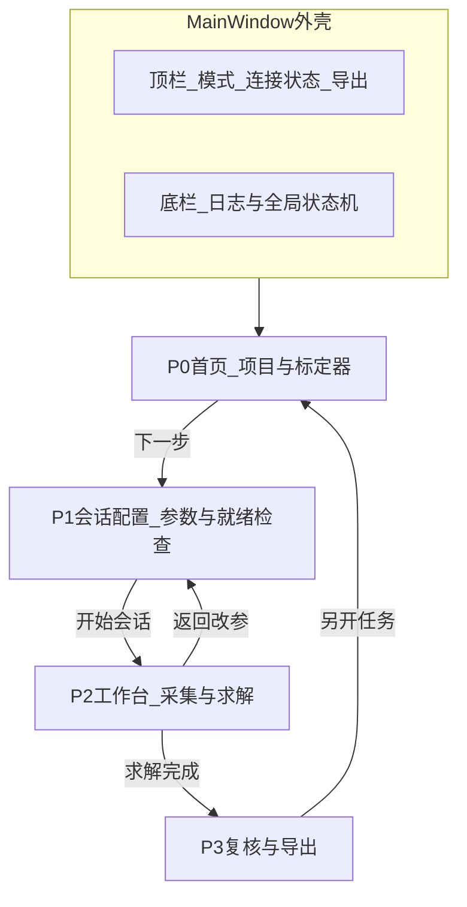
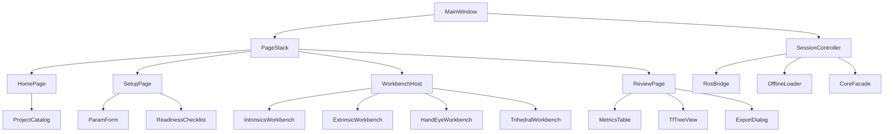

# 界面设计概念（标定管理软件）

本文是 **P0 界面规划定稿方向**，后续 Qt 实现按此推进。  
参考对象：

- [TIER IV `sensor_calibration_manager`](https://github.com/tier4/CalibrationTools)：项目/标定器选择 → 参数配置 → 就绪检查（服务与 TF）→ 求解 → **Initial / Calibration / Final TF 树** → 保存  
- 工业相机标定工具常见模式：实时预览 + 采集相册 + 质量条 + 导出（如 OpenCV / MATLAB Camera Calibrator 一类流程）  
- 本工程约束：`ros2 run` + `config/*.yaml`；界面不做数值求解；算法在 `core/`

当前仓库无可用的 Figma / UI MCP；设计以本文 + 线框为准，实现阶段再出视觉规范。

---

## 1. 设计原则

1. **流程优先于控件堆叠**：先选「做什么」，再进「工作台」；避免一屏塞满所有标定类型。  
2. **状态机清晰**：未配置 → 配置中 → 会话就绪 → 采集中 → 已求解 → 已导出；按钮随状态启用/禁用（对齐 TIER IV「服务与 TF 齐备后才能 Calibrate」）。  
3. **工作台可插拔**：不同标定器共用外壳，中央区换 `IWorkbenchPage` 实现。  
4. **双模式**：在线（ROS 话题/服务/TF）与离线（图片目录 / bag 切片），顶栏可切换。  
5. **结果可审计**：指标表 + 可视化（重投影 / 极线 / 点云投影）+ TF 对比树，缺一不可。

---

## 2. 信息架构（页面级）



| 页面 | 目的 | 主要控件 |
|------|------|----------|
| 首页 | 选项目、标定类别、具体标定器 | 项目卡片/列表、分类树、简介与前置条件 |
| 会话配置 | 编辑/确认 YAML 参数、检查话题与 TF | 参数表单、就绪清单、打开 config 路径 |
| 工作台 | 采集观测、触发求解、看实时反馈 | 预览、观测列表、采集/删除、求解按钮 |
| 复核导出 | 看误差与 TF、写文件 | 指标表、TF 树、导出路径、报告预览 |

---

## 3. 主窗线框（重新设计）

### 3.1 首页 — 项目与标定器

```text
┌────────────────────────────────────────────────────────────────────────────┐
│ HS Calib Suite          [在线●/离线]  [ROS Domain]              [帮助] [关于]│
├──────────────────┬─────────────────────────────────────────────────────────┤
│ 项目             │  标定类别                                                │
│ ○ default_robot  │  ○ 内参   ○ 外参   ○ 手眼   ○ 多传感器                  │
│ ○ arm_cell_A     │                                                         │
│ + 新建项目…      │  ┌─────────────────┐ ┌─────────────────┐                │
│                  │  │ 相机内参         │ │ 直角三面单帧     │                │
│                  │  │ cam_intrinsics  │ │ trihedral_…     │                │
│                  │  │ 多姿态棋盘/ChArUco│ │ 已知夹角三维靶   │                │
│                  │  └─────────────────┘ └─────────────────┘                │
│                  │  说明：前置条件、推荐靶标、预计用时                       │
│                  │                              [下一步：配置会话 →]         │
└──────────────────┴─────────────────────────────────────────────────────────┘
│ 状态：未连接 ROS │ 提示：离线模式可从图片目录标定内参                         │
└────────────────────────────────────────────────────────────────────────────┘
```

### 3.2 会话配置 — 参数与就绪检查（对齐 TIER IV「Launcher configuration」）

```text
┌────────────────────────────────────────────────────────────────────────────┐
│ ← 返回首页     会话配置：default_robot / cam_intrinsics                      │
├────────────────────────────────────┬───────────────────────────────────────┤
│ 参数（绑定 config/*.yaml）          │ 就绪检查                               │
│ 靶标类型 [charuco ▼]               │ ☑ 参数文件可读                         │
│ 板尺寸 / 字典 / 夹角…               │ ☐ 图像话题有数据   /cam/...            │
│ 图像话题 […]  可浏览               │ ☐ CameraInfo（若需要）                 │
│ 坐标系 parent/child                │ ☐ 标定服务可调用（在线）                │
│ 相机模型 pinhole/fisheye           │ ☐ 所需 TF 存在（外参/手眼）             │
│ [从 YAML 重新加载] [另存为…]        │                                        │
│                                    │ 全部通过前禁用「开始会话」               │
│                         [开始会话 →]│                                        │
└────────────────────────────────────┴───────────────────────────────────────┘
```

说明：本工程用 **编辑 config + 就绪检查** 替代 TIER IV 的 launch 参数页；节点仍建议 `ros2 run`，界面可显示「请先启动：`ros2 run …`」或后续由界面拉起进程（P2 再定，默认不强制）。

### 3.3 工作台 — 内参示例

```text
┌────────────────────────────────────────────────────────────────────────────┐
│ ← 配置   工作台：相机内参                          [采集] [删除选中] [求解]   │
├──────────────────────────────┬───────────────────┬─────────────────────────┤
│ 实时/冻结预览 + 检测叠加      │ 观测相册           │ 会话指标                 │
│                              │ #01 ✓ 角点 48     │ 已采集 N 帧              │
│                              │ #02 ✓ 角点 48     │ 覆盖提示：边缘不足        │
│                              │ #03 ✗ 检测失败    │ 建议再采倾斜姿态          │
├──────────────────────────────┴───────────────────┴─────────────────────────┤
│ 日志：检测耗时 / 丢帧 / 服务调用                                            │
└────────────────────────────────────────────────────────────────────────────┘
```

### 3.4 工作台 — 外参 / 相机–激光（对齐 TIER IV 可视化）

中央区改为：

- **图像视图**（可叠加：检测框、投影点云、重投影）  
- **点云 / 深度辅助视图**（可选）  
- **三棵 TF 树**：初始树 | 本次标定树 | 后处理后的最终树（对标 TIER IV Initial / Calibration / Final）  
- 右侧：**可视化选项**（标记尺寸、点云抽稀、用 initial_tf 还是 current_tf 做投影对比）

### 3.5 复核与导出

```text
┌────────────────────────────────────────────────────────────────────────────┐
│ 复核：cam_intrinsics                         [导出 YAML] [导出报告] [完成]   │
├──────────────────────┬─────────────────────────────────────────────────────┤
│ 指标表               │ 残差可视化 / TF 差分                                  │
│ RMSE 0.21 px         │ （重投影热力或极线检查图）                             │
│ 最大误差 …           │                                                       │
│ 有效观测 18/20       │ 保存路径：~/calib_out/2026-…/                         │
└──────────────────────┴─────────────────────────────────────────────────────┘
```

---

## 4. 界面模块架构



- **SessionController**：会话状态机；在线走 `RosBridge`（话题、服务、TF），离线走 `OfflineLoader`；求解一律经 `CoreFacade` → `hs_calib::core`（或经 ROS 服务间接调用同一套 core）。  
- **WorkbenchHost**：按 `calibrator_id` 创建对应工作台页。  
- **禁止**：Workbench / MainWindow 内直接写 OpenCV 标定 API。

---

## 5. 与 TIER IV 界面能力对照

| TIER IV 界面能力 | 本工程对应 |
|------------------|------------|
| 选 Project / Calibrator | 首页双栏选择 |
| Launcher configuration | 会话配置页（编辑 config + 就绪检查） |
| 服务/TF 就绪后启用 Calibrate | 工作台「求解」按钮绑定同一类就绪条件 |
| 图像视图 + 可视化选项 | Extrinsic / Cam-Lidar 工作台 |
| Initial / Calibration / Final TF 树 | 复核页与外参工作台的三树视图 |
| Save calibration | 复核页导出 |

本工程增量：内参「观测相册 + 覆盖度提示」、直角三面专用工作台、离线目录模式、手眼采样列表。

---

## 6. 视觉风格（P0 已在 Qt 落地）

- **科技风**：深空蓝底（`#060912`）+ 电光青强调（`#5ce1ff`）  
- 等宽字体用于品牌、步骤、指标与 YAML  
- 标定磁贴 / 主按钮带轻微线性高光；预览区深色斜向底  
- 样式表：`src/gui/theme/app_style.cpp`

---

## 7. 实现阶段（界面）

| 阶段 | 界面交付 |
|------|----------|
| P0 | 四页 + 主题样式；流程可点通，无业务求解 |
| P1 | 内参工作台接预览/采集、YAML 表单、复核导出 |
| P2 | TF 三树、点云投影、手眼工作台、就绪检查接 ROS |
| P3 | 多传感器套件任务列表、批量导出 |

类图见 [CLASS_DIAGRAMS.md](CLASS_DIAGRAMS.md)。  
启动：`ros2 run hs_calib_suite hs_calib_gui`。
